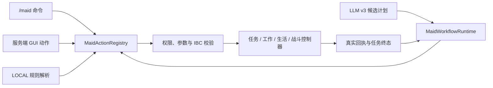

# AI Partner

AI Partner 是面向 Minecraft Java Edition 26.1.2 的 Fabric 女仆伙伴模组。项目用“指令—行为契约”（Instruction–Behavior Contract, IBC）把命令、GUI、本地自然语言和 LLM 计划统一成服务端可验证的语义动作；模型只负责理解与规划，不直接控制移动、攻击、方块、容器或 NBT。

仓库元数据版本为 `0.10.0`，当前自然语言协议为 `3.0`。

## 当前能力

- 可绑定的 AI 女仆实体、多女仆索引与当前目标选择；
- 原生主手、35 格储物、四格护甲、副手及安全工具租用；
- 2×2 / 3×3 原版配方制作、工作物资递归准备与工作台搜索/放置；
- 日班、夜班、全天日程，以及独立工作、休闲、睡眠地点和活动半径；
- 17 种持续工作：种植、甘蔗、瓜类、可可、采集、除雪、养蜂、剪毛、挤奶、照料主人、繁殖、插火把、灭火、伐木、采矿、熔炼、钓鱼；
- `OFF`、`SELF_DEFENSE`、`DEFEND_OWNER` 三种战斗策略，真实近战/弓箭切换及任务暂停恢复；
- `FOLLOW`、`STAY`、`COLLECT_BLOCK`、`DEPOSIT_ITEM`、`TRANSFER_ITEM`、`COLLECT_AND_DEPOSIT`、`CANCEL` 类型化任务；
- 回家导航、床上睡眠、无床休息、喂食、通用拾取、经验修补、好感与成长；
- 64×64 PNG 自定义皮肤、声音、聊天气泡和服务端权威 GUI；
- 每个女仆独立持久化的 `LOCAL` / `LLM` 驱动、连续对话记忆和最多 6 步的有界语义工作流。

行为优先级为：GUI 暂停 > 合法战斗中断 > 有限任务 > 手动指令 > 日程工作/生活 > 空闲行为。只有跟随主人可在长距离卡住后使用原版安全瞬移；战斗、回家、工作、休闲和睡眠只寻路。

## 执行边界



所有入口都经过主人、实体存活、维度、参数白名单和运行时不变量检查。有限任务在服务器上编译为 `TaskContract`，保存主人、维度、执行原点、目标谓词、恢复预算和超时；采集与存箱只有在实际物品增量达到目标后才能进入完成态。工作流只根据服务器回执推进，模型文本不能宣告成功。

更完整的模块说明见 [架构文档](docs/ARCHITECTURE.md)，LLM 协议与工作流约束见 [LLM 有界工作流](docs/LLM_BOUNDED_WORKFLOW_ZH.md)，本轮代码审查、清理决策与剩余风险见 [全项目 Review](docs/PROJECT_REVIEW_ZH.md)。

## 开发环境

- Minecraft Java Edition 26.1.2
- Java 25
- Fabric Loader 0.19.3
- Fabric API 0.155.2+26.1.2
- Fabric Loom 1.17.9

Windows：

```powershell
.\gradlew.bat test
.\gradlew.bat build
.\gradlew.bat runClient
```

`build` 会编译服务端、客户端、Mixin、资源和测试。当前测试以纯 Java/JUnit 边界测试为主；它不能替代真实世界 tick、寻路、区块加载和客户端交互验收。

## 游戏内使用

默认按 `R` 打开对话框。`@女仆名称 指令` 可临时指定本条消息的目标，不改变 `/maid select` 的长期选择。潜行右键女仆打开背包与生活/工作界面；普通右键可喂食或穿戴手持护甲。

主要命令：

```text
/maid spawn
/maid list
/maid select <UUID前缀或唯一名称>
/maid follow | stay | home | cancel
/maid name <名称>
/maid schedule day|night|all-day
/maid location set|clear work|leisure|sleep
/maid home-bound <true|false>
/maid radius <1..服务器上限>
/maid work <工作模式>
/maid combat off|self-defense|defend-owner
/maid status | inventory | retrieve
/maid driver
/maid driver mode local|llm
/maid driver clear-memory
/maid collect <方块ID> [数量] [半径]
/maid deposit <物品ID> [数量] [半径]
/maid transfer <物品ID> [数量] [半径]
/maid collect-and-deposit <方块ID> [数量] [半径]
/maid <自然语言消息>
/maid-skin upload <本地64×64 PNG路径>
/maid-skin clear
```

`/maid-skin` 是客户端命令；图片在客户端预检后仍会由服务器重新验证并重编码。工作模式的完整名称可在 GUI 中选择，也可查看 `MaidWorkMode` 的序列化名称。

## 配置

生活玩法配置首次启动后生成于 `config/ai-partner-gameplay.json`，无密钥示例见 [config/ai-partner-gameplay.example.json](config/ai-partner-gameplay.example.json)。它控制女仆数量、活动半径、日程边界、睡眠恢复、好感冷却、拾取、声音和聊天气泡。

LLM 配置生成于 `config/ai-partner.json`，示例见 [config/ai-partner.example.json](config/ai-partner.example.json)。默认端点为 OpenAI-compatible Chat Completions 接口；API Key 只通过所配置的环境变量读取，密钥值不会进入 UI、网络包、配置、存档或日志。

每个新女仆默认使用 `LOCAL`，主人可以逐女仆切换驱动模式；端点、模型和 API Key 环境变量名只能由服务器管理员在全局配置中设置。切换到 `LLM` 后：

每个女仆只保留最近 12 条、每条最多 512 字符的连续对话；主人可用 `/maid driver clear-memory` 清空当前女仆的记忆，同时取消仍在途的旧模型响应。

1. 端点未启用或密钥环境变量缺失时，能被本地规则明确识别的单意图会安全降级到本地执行；其余请求会拒绝；
2. 已发出的 HTTP 请求若网络失败、超时或返回非法协议，不会再偷偷执行另一项动作；
3. 紧急取消始终保留本地通道；
4. 模型只能返回严格协议中的对话行为与白名单动作，不能提交命令、坐标、NBT 或任意代码。

## 世界行为与安全限制

- 持续工作只在日程处于 `WORK` 且满足活动地点、半径、区块、工具和背包条件时运行；
- 会修改世界的动作遵守 `mobGriefing`；熔炉和钓鱼等不依赖破坏方块的规则可独立运行；
- 伐木先识别自然树并排除邻接木制结构；采矿只处理有安全站位、暴露且无邻接岩浆的受支持矿石；
- 熔炼复验熔炉租约、配方和物品守恒；钓鱼使用真实浮标和原版战利品；
- 通用物流只向可访问且容量足够的普通单箱移动请求的精确数量；
- 外部变更命令或 GUI 操作会中断活动工作流，避免旧计划稍后继续修改状态；只读查询不会中断。

## 持久化与兼容

当前写入格式只保存玩法运行所需状态：实体控制器、背包与装备、任务契约和快照、工作流游标与证据、生活/工作/战斗/成长状态、皮肤哈希及驱动设置。

代码仍保留少量只读迁移路径，用于旧世界中的压缩背包、混合行为模式、早期任务快照和旧工作流格式。这些兼容字段不会再由新存档写出，也不会重新启用旧实验变体或关闭现行安全检查。

## 当前验证重点

自动测试覆盖协议 Schema/codec 对齐、全部语义动作注册、计划边界、重规划目标保持、契约生命周期与持久化、恢复/超时预算、命令参数、背包迁移、制作、复杂工作规则、成长、皮肤和端点策略。

仍需通过真实 GameTest 或开发客户端持续验证的高风险区域包括：长时间寻路与区块卸载、多人同时操作、重启中断点、熔炉/工作台竞争、复杂计划的终态叙述，以及回家指令“已接收”和“已到达”之间的区别。
