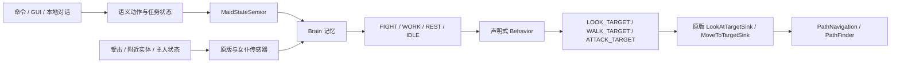

# AI Partner

AI Partner 是面向 Minecraft Java Edition 26.1.2 的 Fabric 女仆伙伴模组。当前版本为 `0.11.0`。

从 `0.11.0` 起，项目已删除全部 LLM、远程模型请求、模型配置、对话记忆和多步模型工作流代码。R 键对话框仍然保留，但只使用服务端本地规则解析，不发送网络请求。女仆的自主 AI 已改为 Minecraft 原版风格的 `Brain` 记忆—传感器—Activity—Behavior 系统。

## 当前能力

- 可绑定的女仆实体、多女仆索引、当前目标选择与持久化；
- 原生主手、35 格储物、四格护甲、副手和安全工具租用；
- 2×2 / 3×3 原版配方制作、工作物资准备与工作台搜索/放置；
- 日班、夜班、全天日程，以及独立工作、休闲、睡眠地点和活动半径；
- 17 种持续工作：种植、甘蔗、瓜类、可可、采集、除雪、养蜂、剪毛、挤奶、照料主人、繁殖、插火把、灭火、伐木、采矿、熔炼、钓鱼；
- `OFF`、`SELF_DEFENSE`、`DEFEND_OWNER` 三种战斗策略，支持近战、弓箭、攻击冷却和任务中断恢复；
- `FOLLOW`、`STAY`、`COLLECT_BLOCK`、`DEPOSIT_ITEM`、`TRANSFER_ITEM`、`COLLECT_AND_DEPOSIT`、`CANCEL` 类型化任务；
- 回家、床上睡眠、无床休息、喂食、拾取、经验修补、好感与成长；
- 64×64 PNG 自定义皮肤、声音、聊天气泡和服务端权威 GUI；
- 中英文离线规则对话、两分钟澄清上下文和明确的安全拒绝。

## 原版风格 Brain AI



`CORE` Activity 始终运行，负责 GUI 暂停、游泳、注视、移动汇接和开门。非核心 Activity 按 `FIGHT → WORK → REST → IDLE` 选择第一个满足记忆条件的活动。

自主行为只写入记忆：

- 跟随、回家和日程地点写入 `LOOK_TARGET` / `WALK_TARGET`；
- `MoveToTargetSink` 读取目标并驱动原版导航；
- `CANT_REACH_WALK_TARGET_SINCE` 记录不可达时间；
- 只有跟随主人可在距离至少 12 格且持续不可达 60 tick 后尝试原版安全传送；
- 战斗目标、视野和攻击冷却同样由 Brain 记忆协调；
- GUI 打开、指令切换、任务切换和 Activity 退出会清理过期移动记忆。

有限工作任务仍是有明确开始、进度、物品守恒和完成条件的服务端状态机。任务运行时通过 `TASK_CONTROLLED` 记忆暂停自主移动，避免 Brain 与采集、存箱、制作等确定性世界动作争夺导航。

完整设计见 [架构文档](docs/ARCHITECTURE.md)，原版 AI 学习与项目映射见 [Brain AI 机制说明](docs/BRAIN_AI_ZH.md)，真实客户端验收记录见 [真实游戏测试报告](docs/REAL_GAME_TEST_ZH.md)。

## 开发环境

- Minecraft Java Edition 26.1.2
- Java 25
- Fabric Loader 0.19.3
- Fabric API 0.155.2+26.1.2
- Fabric Loom 1.17.9

Windows：

```powershell
.\gradlew.bat test --no-daemon
.\gradlew.bat build --no-daemon
.\gradlew.bat runClient --no-daemon
```

若需要把 Gradle 缓存限制在仓库内：

```powershell
$env:GRADLE_USER_HOME = (Resolve-Path ".gradle-user-home").Path
.\gradlew.bat test --no-daemon
```

## 游戏内使用

默认按 `R` 打开本地对话框。`@女仆名称 指令` 可只为本条消息指定目标，不改变 `/maid select` 的长期选择。潜行右键女仆打开背包与生活/工作界面；普通右键可喂食或穿戴手持护甲。

主要命令：

```text
/maid spawn
/maid list
/maid select <UUID前缀或唯一名称>
/maid follow | stay | home | cancel
/maid name <名称>
/maid schedule day|night|all-day
/maid location set|clear work|leisure|sleep
/maid home-bound <true|false>
/maid radius <1..服务器上限>
/maid work <工作模式>
/maid combat off|self-defense|defend-owner
/maid status | inventory | retrieve
/maid collect <方块ID> [数量] [半径]
/maid deposit <物品ID> [数量] [半径]
/maid transfer <物品ID> [数量] [半径]
/maid collect-and-deposit <方块ID> [数量] [半径]
/maid <本地自然语言消息>
/maid-skin upload <本地64×64 PNG路径>
/maid-skin clear
```

本地对话可识别跟随、待命、取消、回家、有限采集/物流任务、日程、战斗策略、活动地点、活动半径、改名、状态/背包查询和持续工作模式。不能可靠确定含义时会要求澄清；建造、任意传送等不受支持的请求会明确拒绝。

## 配置

玩法配置首次启动后生成于 `config/ai-partner-gameplay.json`，示例见 [config/ai-partner-gameplay.example.json](config/ai-partner-gameplay.example.json)。它控制女仆数量、活动半径、日程边界、睡眠恢复、好感冷却、拾取、声音和聊天气泡。

项目不再读取端点、模型或 API Key 配置。旧安装遗留的 `config/ai-partner.json` 不会被加载，可由服主自行备份后删除。

## 世界行为与安全边界

- 所有命令、GUI 和本地对话动作都在服务端重新验证主人、实体、维度和参数；
- 持续工作只在日程处于 `WORK` 且满足地点、半径、区块、工具和背包条件时运行；
- 会修改世界的动作遵守 `mobGriefing`；
- 伐木识别自然树并排除邻接木制结构；
- 采矿只处理有安全站位、暴露且无邻接岩浆的受支持矿石；
- 熔炼复验熔炉租约、配方和物品守恒；
- 跟随之外的活动不会用传送掩盖寻路失败；
- 战斗不会选择玩家、主人、同阵营实体或活动边界外目标。

## 存档兼容

新存档只写入玩法所需的实体、背包、任务、生活、工作、战斗、成长和皮肤状态。Brain 自定义记忆没有 Codec，属于瞬时运行状态，不写入 NBT；载入后由传感器根据权威状态重建。

旧版本额外写入的远程驱动、对话和工作流字段会被 Minecraft 的 NBT 读取流程忽略，不会重新启用已删除功能。仓库仍保留与物品安全相关的旧背包和任务只读迁移路径。

## 验证

自动测试覆盖契约、参数、任务恢复、制作、背包迁移、工作规则、日程、成长、皮肤和本地解析。`0.11.0` 还在真实 26.1.2 开发客户端中完成了生成、绑定、跟随、驻留、本地对话、近战、自卫 Activity 清理、Brain NBT 和正常退出验收。

单元测试不能替代多人、区块卸载、长时间运行和复杂地形回归；这些场景应继续通过开发客户端或 GameTest 验证。
