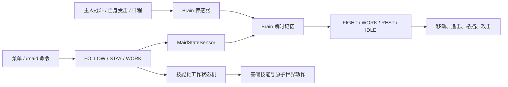

# AI Partner

AI Partner 是面向 Minecraft Java Edition 26.1.2 的 Fabric 女仆伙伴模组，当前版本为 `0.12.0`。行为由服务端权威的 Brain AI、三种长期模式和基础技能系统驱动。

## 当前能力

- 未归属女仆不能直接右键认主；使用 `ai-partner:maid_taming_foods` 中的安全食物可按 1/3 概率驯服；
- 女仆拥有数量不设上限，命令生成也没有默认上限；
- 提供女仆生成蛋；每个新生成的掠夺者前哨站会在塔楼旁额外生成一座有地基、与原结构部件不相交的女仆笼和一只女仆，不替换原版悦灵或铁傀儡笼，也不随怪物刷新重复出现；
- 长期模式只有 `FOLLOW`、`STAY`、`WORK`；战斗采用原版狼式自卫、保护主人和协助攻击逻辑；
- 原生主手、35 格储物、四格护甲和副手；自动比较并装备更好的护甲、盾牌和武器，近战可使用副手盾牌格挡；
- 工作使用适当工具，支持种植、甘蔗、瓜类、可可、采集、除雪、养蜂、剪毛、挤奶、照料主人、繁殖、照明、灭火、伐木、采矿、熔炼和钓鱼；
- 29 项基础技能覆盖导航、拾取、2×2/3×3 制作、徒手/斧/镐/铲/锄操作、种植、放置、容器读写与记忆、三类炉子、动物生产、钓鱼和战斗；
- 日班、夜班、全天日程，独立工作/休闲/睡眠地点与活动半径；
- 喂食、物品/箭/经验拾取、经验修补、成长、好感、声音和聊天气泡；
- 64×64 PNG 自定义皮肤；无自定义皮肤时使用模组内置女仆皮肤。

R 键本地对话、自然语言解析、任务/任务类型、任务契约、`CANCEL` 模式和可选择战斗策略均已删除。

## AI 与技能结构



`WORK_CONTROLLED` 只表示工作控制器暂时接管导航；它不是任务。工作配置是基础技能的组合，例如伐木组合导航、徒手破坏和斧头伐木，熔炼组合导航、熔炉、容器读写和容器记忆。

## 游戏内使用

- 使用安全食物普通右键未归属女仆进行驯服；
- 潜行右键已归属女仆打开菜单；
- 拿拴绳普通右键可拴住女仆；
- 普通空手右键不再查询模式；
- 菜单不显示 2×2 制作格，但女仆仍掌握 2×2 随身制作技能。

主要命令：

```text
/maid spawn
/maid list
/maid select <UUID前缀或唯一名称>
/maid mode follow|stay|work
/maid follow | stay
/maid work [none|farmer|...|fisher]
/maid home
/maid name <名称>
/maid schedule day|night|all-day
/maid location set|clear work|leisure|sleep
/maid home-bound <true|false>
/maid radius <1..服务器上限>
/maid skills
/maid memory
/maid status | inventory | retrieve
```

## 开发与验证

```powershell
$env:GRADLE_USER_HOME = (Resolve-Path ".gradle-user-home").Path
.\gradlew.bat test --no-daemon
.\gradlew.bat build --no-daemon
.\gradlew.bat runClient --no-daemon
```

玩法配置见 `config/ai-partner-gameplay.example.json`。它只控制活动半径、日程、睡眠恢复、好感、拾取、声音和气泡，不包含女仆数量上限。

详细设计见 [架构文档](docs/ARCHITECTURE.md)，真实客户端验收见 [测试记录](docs/REAL_GAME_TEST_ZH.md)。
