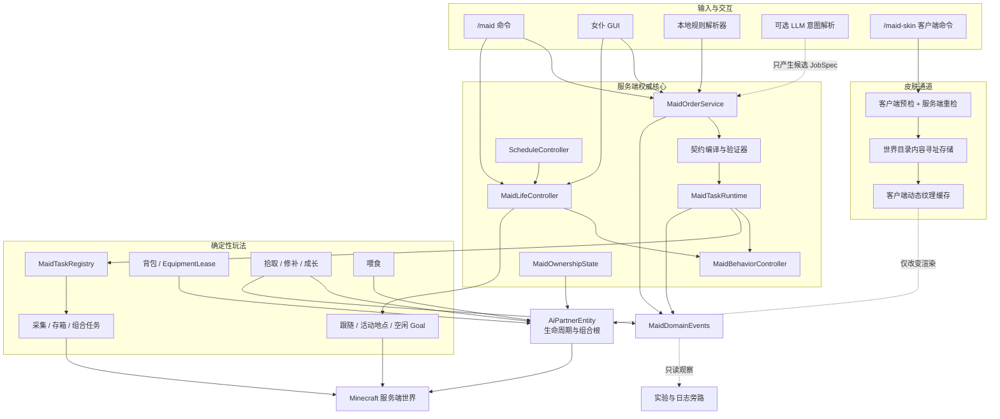
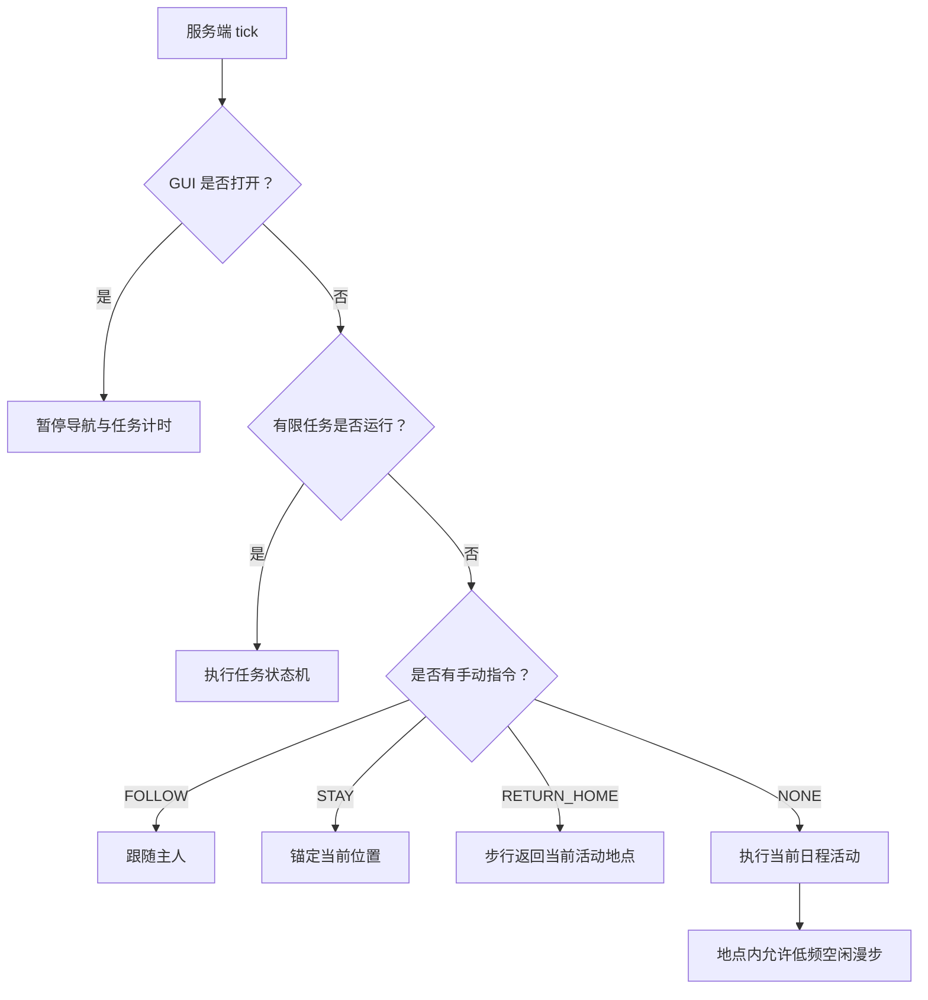
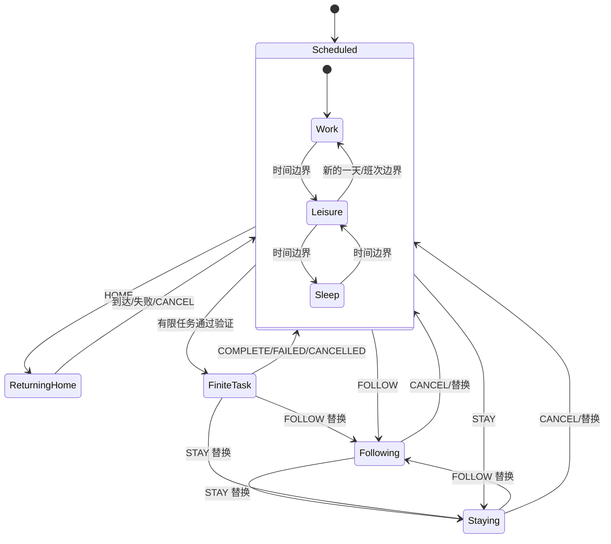
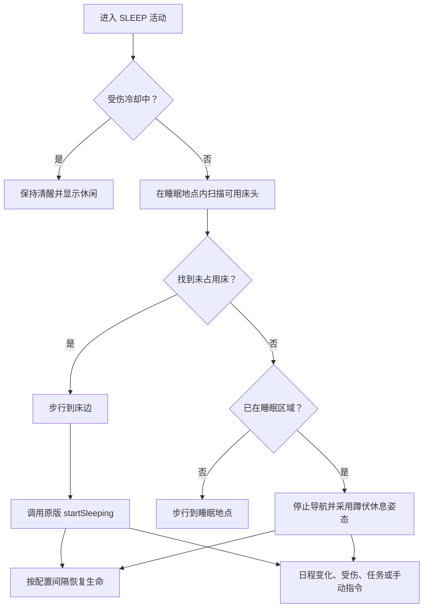
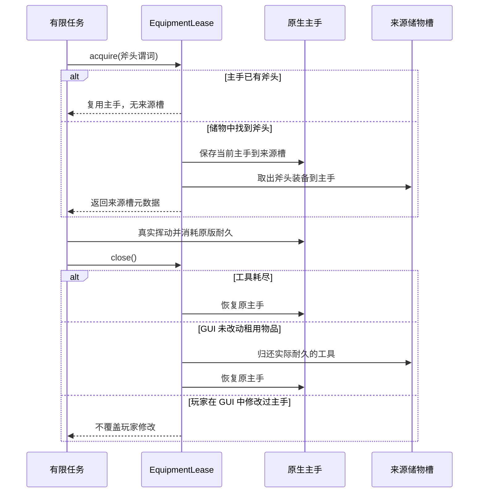
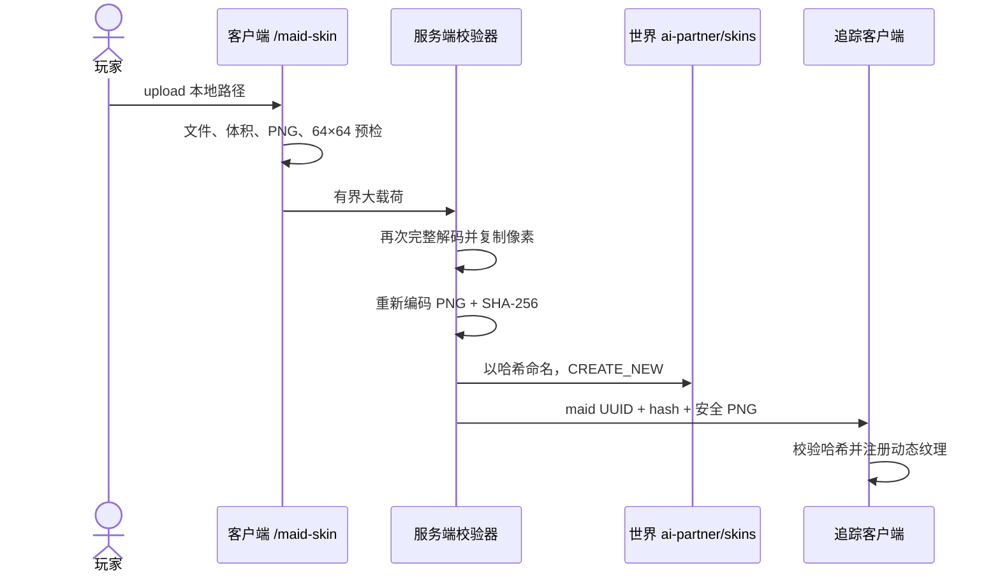

# AI Partner v0.6 架构说明

## 1. 目标与范围

v0.6 在 v0.5 的任务运行时之上加入“生活、日程和物品基础”。本版本不扩张 LLM 能力，也不新增战斗、农业、挖矿、熔炉或钓鱼；它解决的是女仆作为长期伙伴在没有任务时如何生活，以及物品、主人和外观如何安全持久化。

本版本正式新增：

- 持久化主人索引、可配置数量上限和多女仆选择；
- 任意原版可食用食物；
- 原生主手 + 35 格储物、护甲、副手和工具租约；
- 通用物品、箭和经验拾取，以及装备经验修补；
- 日班、夜班、全天工作；
- 工作、休闲、睡眠三个独立活动地点；
- 区域约束、步行回家、睡眠和无床休息；
- 名称、64×64 PNG 皮肤、内置声音和简单聊天气泡；
- 为后续成长预留的好感度、经验和等级数据域。

既有正式任务仍只有：`FOLLOW`、`STAY`、`COLLECT_BLOCK`、`DEPOSIT_ITEM`、`COLLECT_AND_DEPOSIT` 和 `CANCEL`。其中采集仍只支持橡木、白桦和云杉原木。

## 2. 总体架构



依赖保持单向：

- `core` 不导入客户端、LLM、实验、评测或日志包；
- `life` 消费日程结果，但日程计算器不依赖实体或世界；
- Goal 只消费控制器给出的目标，不拥有日程规则；
- 客户端 GUI 和皮肤命令不能直接修改权威实体字段；
- 实验系统只能订阅领域事件，不能参与行为决策。

## 3. 主要模块

| 模块 | 主要类型 | 职责 |
|---|---|---|
| 实体组合根 | `AiPartnerEntity` | 原版实体生命周期、装备、交互、同步字段和控制器组合 |
| 行为仲裁 | `MaidBehaviorController` | 手动指令、有限任务模式、日程背景模式和 GUI 暂停 |
| 日程计算 | `ScheduleWindows`、`ScheduleController` | 无世界副作用地计算活动和下一次转换 |
| 生活控制 | `MaidLifeController` | 活动地点、回家、区域约束、睡眠和长期目标 |
| 生活配置 | `MaidLifeProfile`、`ActivityLocation` | 日程、地点、默认家和半径持久化 |
| 主人索引 | `MaidOwnershipState`、`PartnerService` | UUID 索引、数量上限、生成、查找和选择 |
| 任务运行时 | `MaidTaskRuntime` | 唯一活动契约、暂停、终态、恢复和任务替换 |
| 背包迁移 | `MaidInventoryPersistence` | 新布局保存和 v0.4/v0.5 压缩背包迁移 |
| 工具租约 | `EquipmentLease` | 在主手和储物槽之间安全交换任务工具 |
| 后台拾取 | `MaidPickupController` | 物品、箭、经验球、经验修补和成长经验 |
| 喂食 | `MaidFeedingService` | 原版食物/食用组件、效果、容器返还、恢复和好感 |
| 玩法配置 | `MaidGameplayConfig` | 独立于 LLM 的服务端生活参数 |
| 皮肤安全 | `SkinImageValidator`、`MaidSkinStore`、`MaidSkinNetworking` | 校验、重编码、持久化和追踪同步 |
| 客户端皮肤 | `MaidSkinClient`、`SkinTextureCache` | 本地文件读取和动态纹理生命周期 |

## 4. 行为仲裁与状态投影

权威状态不再由一个枚举承担。它拆成四个正交维度：

| 状态 | 保存位置 | 是否持久化 | 作用 |
|---|---|---:|---|
| `ManualDirective` | `MaidBehaviorController` | 是 | FOLLOW、STAY、RETURN_HOME |
| 活动有限任务 | `MaidTaskRuntime` | 是 | 采集、存箱、组合任务 |
| 当前日程活动 | `MaidLifeController` | 是 | WORK、LEISURE、SLEEP |
| `inventoryMenuOpen` | `MaidBehaviorController` | 否 | 临时暂停导航和任务计时 |

`PartnerMode` 只是同步给客户端、命令和旧存档的有效投影。固定优先级为：



日程时钟即使被任务或手动指令覆盖仍会继续推进；覆盖结束后，下一 tick 直接恢复当前正确活动，不重放已经错过的阶段。

### 4.1 状态转换



GUI 暂停是覆盖层，不是上述持久化状态之一；关闭 GUI 后从原状态继续，并由任务或生活控制器重新检查世界条件。

## 5. 日程系统

默认一天使用原版 24000 tick 时钟：

| 世界时间 | 日班 | 夜班 | 全天工作 |
|---:|---|---|---|
| 0–11999 | 工作 | 睡眠 | 工作 |
| 12000–13999 | 休闲 | 休闲 | 工作 |
| 14000–21999 | 睡眠 | 工作 | 工作 |
| 22000–23999 | 休闲 | 休闲 | 工作 |

边界可在 `ai-partner-gameplay.json` 中配置，但必须严格递增并落在同一天内。全天工作没有伪造的“下一次切换”，GUI 显示为持续工作。

三个活动分别对应独立地点：

- `WORK` → 工作地点；
- `LEISURE` → 休闲地点；
- `SLEEP` → 睡眠地点。

地点保存维度、方块坐标和半径。未单独配置时回退到生成/绑定时记录的默认家位置。修改全局活动半径会同步更新默认家和三个已配置地点。

### 5.1 区域约束与回家

- `homeBound=true` 时，工作和休闲会把原版限制中心设为对应地点；
- 睡眠无论 `homeBound` 是否开启，都会尝试返回睡眠地点；
- `/maid home` 和 GUI“回活动地点”会取消现有任务，然后只通过寻路返回；
- 活动地点位于其他维度时立即结束回家指令并提示，不会跨维度传送；
- STAY 使用独立的当前位置锚点，不会覆盖三个日程地点；
- FOLLOW 和有限任务运行时临时解除 home restriction，结束后由日程重新建立。

只有 FOLLOW 可以在距离较远且持续卡住后调用原版安全传送。RETURN_HOME、WORK、LEISURE 和 SLEEP 永远不传送。

### 5.2 睡眠状态机



床位每 100 tick 重扫，且只检查已加载区块；受伤后默认 200 tick 内不会重新入睡。

## 6. 主人与多女仆选择

原版驯服主人 UUID 仍是所有权事实来源，`MaidOwnershipState` 只是跨重启索引：

```text
owner UUID -> 有序 maid UUID 集合 + selected maid UUID
```

- 默认每位主人最多 1 名，可配置为 1–32；
- `/maid spawn` 在玩家附近检查边界、支撑面、流体和碰撞后生成；
- `/maid list` 列出当前已加载女仆；
- `/maid select <UUID前缀或唯一名称>` 设置后续命令目标；
- 命令优先使用已选择且已加载的女仆，否则回退到同维度优先、距离最近的已加载女仆；
- 实体死亡或其他破坏性移除时从索引注销，卸载区块不会误注销。

索引保留未加载女仆，以防通过卸载区块绕过数量上限；因此普通命令不会强制加载区块。

## 7. 背包、装备与迁移

### 7.1 新布局

| GUI 槽位 | 权威存储 | 数量 |
|---|---|---:|
| 物品区第 0 格 | 原生 `EquipmentSlot.MAINHAND` | 1 |
| 物品区第 1–35 格 | `SimpleContainer` | 35 |
| 护甲 | 原生 HEAD/CHEST/LEGS/FEET | 4 |
| 副手 | 原生 OFFHAND | 1 |

因此“36 格背包”是玩家式的 1 个主手入口加 35 格储物，护甲和副手额外计算。任务存箱只转移储物区物品，不会意外存走当前主手工具。

### 7.2 v0.4/v0.5 迁移

旧版 `Inventory` 是不保存空槽位置的 36 项压缩列表。v0.6 迁移规则为：

1. 旧列表第一项迁入原生主手；
2. 其余项目按原顺序进入 35 格储物；
3. 如果实体已有原生主手，旧第一项尝试进入储物；
4. 无法容纳的冲突物品不丢弃，在实体进入服务端世界后显式掉落；
5. 新版使用 `MaidStorage` 子结构保存精确槽位；
6. 加载后只写新格式，不继续制造旧压缩列表。

### 7.3 EquipmentLease



租约来源槽写入任务快照，服务器重启后可以恢复交换关系。采集转入存箱阶段时立即归还斧头。

## 8. 拾取、修补、喂食和成长种子

### 8.1 后台拾取

- `ItemEntity` 使用原版 `InventoryCarrier` 部分插入语义；
- 落地且允许拾取的箭在 1.5 格范围内进入储物；
- 经验球按原版合并球计数逐个消费；
- 经验优先随机修补已装备且带修补效果的损坏物品；
- 剩余经验进入 `MaidGrowthData`；
- STAY 和 homeBound 会限制后台拾取位置，FOLLOW 和有限任务可临时解除活动区限制；
- GUI 打开时停止后台拾取，避免与容器操作竞争。

### 8.2 喂食

只有同时带原版 `FOOD` 和 `CONSUMABLE` 组件的物品才被接受。系统在服务端用一份单物品副本调用原版 `finishUsingItem`，因此药水效果、负面效果和容器返还仍遵循原版；女仆额外按营养值恢复生命。

食物默认每 1200 tick 最多增加 1 点好感。好感上限 1000；当前等级只是基于成长经验的显示数据，不解锁或限制基础能力。完整成长曲线仍属于 v0.8。

## 9. 名称、皮肤、声音与气泡

### 9.1 皮肤上传



安全边界：

- 最大上传体积 256 KiB；
- 必须具有 PNG 签名并能完整解码；
- 尺寸必须严格为 64×64；
- 服务器不信任客户端预检，会重新解码、复制像素并重编码以剥离元数据；
- 实体 NBT 只保存 64 位十六进制哈希，大字节存放在当前世界目录；
- 只向追踪该实体的客户端和上传者同步；
- 当前所有自定义皮肤都按 Alex 瘦臂模型渲染。

### 9.2 声音和气泡

当前“语音”是无需额外资源包的原版 Allay 短音效反馈，不是可配置语音包。聊天气泡通过实体同步组件和过期 tick 渲染为名称上方的短文本；喂食、任务开始/完成/失败和日程切换会触发。

## 10. GUI 与命令

潜行右键打开的菜单由服务端真实容器和 15 项 `ContainerData` 驱动，显示：

- 主手、35 格储物、护甲、副手和玩家背包；
- 生命、有效模式、任务和契约状态；
- 日程类型、当前活动和下次转换；
- homeBound、活动半径和三个地点是否单独配置；
- 好感度、成长等级和经验；
- 跟随、待命、取消、回家、切换日程、地点设置/清除和半径按钮。

生活命令：

```text
/maid spawn
/maid list
/maid select <maid>
/maid name <name>
/maid follow
/maid stay
/maid home
/maid cancel
/maid schedule day|night|all-day
/maid location set|clear work|leisure|sleep
/maid home-bound <true|false>
/maid radius <radius>
/maid status
/maid inventory
/maid retrieve
/maid-skin upload <local path>
/maid-skin clear
```

`/maid-skin` 是客户端命令；其余是服务端命令。带任务语义的命令和 GUI 按钮仍通过 `MaidOrderService`，纯生活配置直接调用拥有者已验证的实体 API。

## 11. 持久化格式

`AiPartnerDataVersion = 2`。新增主要字段：

```text
MaidStorage/*
ScheduleType
CurrentScheduleActivity
HomeBound
ActivityRadius
DefaultHomeDimension / Position / Radius
ActivityLocationWORK*
ActivityLocationLEISURE*
ActivityLocationSLEEP*
StayAnchor*
SleepBlockedUntil
MaidAffection
MaidGrowthExperience
LastFoodAffectionGameTime
MaidSkinHash
```

主人索引使用世界级 SavedData，不写进单个实体。皮肤文件存于：

```text
<world>/ai-partner/skins/<sha256>.png
```

v0.5 的契约、任务快照和兼容字段继续读写。生活配置和有限任务彼此独立，因此任务重启恢复不会覆盖日程地点，日程切换也不会重置任务进度。

## 12. 线程与安全边界

- 实体、日程、导航目标、背包、契约和皮肤应用都在服务器线程修改；
- LLM HTTP 仍在外围异步执行，结果回到服务器线程后才进入订单服务；
- 客户端只上传候选字节和发送白名单按钮 ID；
- GUI 的 `ContainerData.set` 不反向修改实体；
- 皮肤网络载荷有显式字节上限；
- 所有活动地点带维度，跨维度只安全停止，不推测传送目的地；
- 只有 FOLLOW Goal 可调用安全传送；
- 死亡会失败当前任务、注销主人索引，并按原版掉落主手、副手、护甲和储物物品；
- 打开 GUI 时有限任务、生活导航和后台拾取暂停，关闭后重新检查条件。

## 13. 测试与验收

当前 60 项单元测试包括：

- 日班、夜班、全天工作全部时间边界和日循环；
- 日程窗口非法配置；
- 主人索引注册、选择、注销和编解码；
- 旧 36 格压缩背包迁移、新 35 格储物往返和冲突溢出；
- 64×64 PNG、错误尺寸、错误签名和元数据重编码；
- 好感/经验边界；
- 菜单动作 ID 白名单和 RETURN_HOME 指令解析；
- v0.5 既有解析器、契约、任务快照和冻结数据回归。

完整 `build` 会同时编译服务端、客户端、Mixin 和测试。真实寻路、床位占用、跟随传送和多人追踪仍需要开发世界人工验收；自动 GameTest 计划保留到稳定性里程碑，不在此处把单元测试冒充为游戏内集成测试。

## 14. 当前明确不做

v0.6 不包含：

- 战斗、农业、采集动物产品、喂主人/动物、插火把或灭火；
- 整树识别、挖矿、熔炉、钓鱼或通用物流；
- 基于好感/等级的属性增益或能力锁；
- 宽臂皮肤选择、自定义模型、动画或语音包；
- 跨维度任务和跨维度回家；
- 祭坛、东方战斗、P 点、弹幕、饰品、复活/运输、娱乐设施、自动化设施或模组兼容层。

v0.7 承接基础工作包；整树砍伐、挖矿、熔炉、钓鱼和完整成长属于 v0.8。长期路线见 [FOUNDATION_ARCHITECTURE_ROADMAP_ZH.md](./FOUNDATION_ARCHITECTURE_ROADMAP_ZH.md)。

## 15. 冻结实验说明

v0.4 的数据、Prompt、Schema、场景和结果仍保持原样。v0.6 是基础模组开发版本，实体、运行时和方块动作字节码已经变化，因此不应把它直接当成 v0.4 冻结实验的等价执行制品。下一轮论文实验必须在 v0.6 玩法地基稳定后重新冻结候选、实现指纹和预注册边界。
