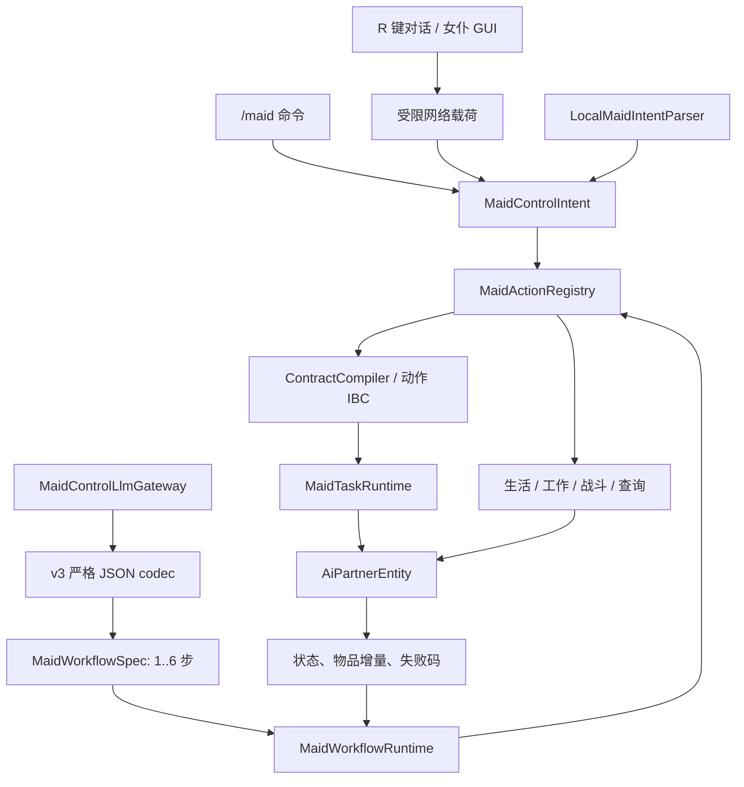

# AI Partner 现行架构

本文是代码清理后的权威架构说明。历史实验协议、离线评测器和版本路线文档不属于现行产品运行时；如与旧提交记录冲突，以本文件和当前代码为准。

## 1. 设计边界

项目遵循四条核心约束：

1. **服务器权威**：客户端、命令、本地解析器和模型都只能提出类型化意图，不能直接修改世界；
2. **单一语义入口**：所有玩家可触发的女仆能力最终进入 `MaidActionRegistry`；
3. **执行与叙述分离**：LLM 可以生成回应和计划，但成功/失败只能来自服务器回执；
4. **有界并可恢复**：任务、工作流、搜索、导航、重试、超时和持久化字段都有明确上限。



## 2. 启动与端划分

`AiPartnerMod` 是通用/服务端入口，注册实体、菜单、皮肤网络、对话网络、工作流事件桥和 `/maid` 命令；服务器停止时取消仍在途的模型请求。

`AiPartnerClient` 注册渲染器、GUI、R 键对话和 `/maid-skin` 客户端命令。客户端只提交枚举、字符串、UUID 或图片字节等受限输入；权限、目标实体和数据格式均在服务器复验。

Mixin 只服务于缺少公开访问面的原版能力：熔炉内部字段、经验球修补、钓鱼浮标状态及渲染。`ai-partner.mixins.json` 是这些类的注册入口。

## 3. 语义控制面

### 3.1 意图模型

`MaidControlIntent` 是 sealed 接口，覆盖：

- `RunTask(JobSpec)`；
- 工作模式、日程、战斗策略；
- 回家、活动地点、回家范围约束和活动半径；
- 改名；
- 状态查询、背包查询和背包取回。

它不允许携带任意命令、世界坐标、NBT、脚本或逐 tick 操作。`JobSpec` 仍是有限任务的内部参数对象，不再是 LLM 协议边界。

### 3.2 动作注册表

`MaidActionRegistry` 为每个意图声明：

- 公共前置条件：女仆存活、执行者为主人、同维度、参数在界内；
- 目标谓词：状态已观察、查询已产生、物品已转移或任务契约已接受；
- 公共不变量：执行后主人和维度关系仍成立；
- 完成形态：即时完成或等待任务契约。

注册表先验证、再执行、最后复验后置条件。直接变更会中断旧工作流；状态和背包查询是只读操作，不会中断。GUI 会先把“循环下一个值”转换为明确目标值再进入注册表，因此协议不依赖按钮编号。

### 3.3 输入驱动

- `/maid` 明确子命令直接构造类型化意图；兜底的 `/maid <message>` 进入对话服务；
- `LOCAL` 使用中英文规则解析器，单次产生一个意图、澄清、拒绝或社交回应；
- `LLM` 使用 OpenAI-compatible Chat Completions，输出必须通过协议 `3.0` Schema、严格 codec 和请求阶段形状检查；
- `@名称` 或 UUID 前缀只改变本条消息的目标解析，不修改持久化选择；
- 紧急取消始终先由本地解析器识别。

## 4. 有限任务与 IBC

### 4.1 编译阶段

`ContractCompiler` 通过 `TaskDefinitionRegistry` 和 `TaskContractValidatorRegistry` 查找任务定义与验证器。验证器检查目标白名单、数量、半径、工具、背包容量、容器及世界规则，返回接受或带 `FailureCode` 的拒绝。

接受后的 `TaskContract` 保存：

- UUID、`JobSpec`、状态和类型化失败码；
- 前置条件、目标谓词和运行时不变量文本；
- 最大本地恢复次数与任务超时；
- 接受者 UUID、维度和固定执行原点。

单任务契约不管理 LLM 重规划；该预算只存在于工作流层。

### 4.2 执行阶段

`MaidTaskRuntime` 保证每个女仆最多只有一个活动契约。`FOLLOW` / `STAY` 被转换为长期 `ManualDirective`；`CANCEL` 原子取消当前活动；其余任务从 `MaidTaskRegistry` 创建执行器适配器。

当前有限任务：

| 任务 | 执行方式 | 完成证据 |
|---|---|---|
| `COLLECT_BLOCK` | 搜索、导航、复验、破坏、拾取 | 指定物品的真实背包增量 |
| `DEPOSIT_ITEM` | 搜索普通单箱、导航、复验、精确转移 | 实际存入数量 |
| `TRANSFER_ITEM` | 复用安全存箱执行器 | 实际存入指定物品数量 |
| `COLLECT_AND_DEPOSIT` | 固定采集后存箱的两阶段组合 | 两段证据均满足 |

运行时每 tick 复验主人、维度、执行原点半径、`mobGriefing` 和任务专属边界。恢复预算始终启用；任何旧存档中的实验开关都不能关闭监控或恢复。执行器回调只有在独立目标谓词检查通过后才可把契约标为 `COMPLETED`。

任务快照使用版本化 `MaidTaskSnapshot`。当前格式写入稳定阶段、剩余超时及必要进度；加载失败、未知格式或不一致状态时失败关闭。

## 5. LLM 对话与工作流

模型根对象只允许 `schema_version`、`dialogue_act`、`plan`、`response_text`。可用对话行为是 `PROPOSE_PLAN`、`ASK_CLARIFICATION`、`REJECT_UNSUPPORTED` 和 `SOCIAL_REPLY`；模型不能使用本地解析器专用的 `PROPOSE_INTENT`。

`MaidWorkflowSpec` 的硬边界：

- 1～6 个已注册语义动作；
- 最多一次重规划；
- 总期限最多 600 秒；
- `FOLLOW`、`STAY` 和 `RETURN_HOME` 等持续移动指令只能位于末步。

`MaidWorkflowRuntime` 串行派发步骤。即时动作必须拿到已复验回执；有限任务必须等待关联 `TaskContract` 的权威终态。失败重规划不能删除、改变或重排尚未完成的原目标，只能增加准备动作。计划耗尽但仍有待完成目标时，以 `CONTRACT_VIOLATION` 失败。

工作流持久化 UUID、主人、来源、原请求、步骤、待完成目标、游标、期限、预算、活动任务 UUID 和有界证据。完成/失败事件经 `MaidDomainEvents` 交给对话服务生成结果约束叙述；网关不可用时使用确定性真实结果文本。

注意：当前 `RETURN_HOME` 的即时后置条件是“回家指令已激活”，不是“已经到达”。因此它只能作为计划末步，但终态叙述仍需避免把指令接收误写成实际抵达。

## 6. 实体聚合与行为调度

`AiPartnerEntity` 是 Minecraft 实体外壳和控制器聚合根，负责同步数据、交互、存档及公开委托 API。每 tick 的主要调用顺序为：

1. `MaidCombatController`；
2. `MaidTaskRuntime`；
3. `MaidWorkflowRuntime`；
4. `MaidLifeController`；
5. `MaidWorkController`；
6. `MaidPickupController`。

`MaidBehaviorController` 将手动指令、有限任务、日程背景和临时战斗中断投影为单一客户端模式。GUI 打开与战斗中断只暂停活动任务，不销毁契约；战斗结束后任务重新通过运行时不变量再继续。

### 6.1 生活与日程

`MaidLifeController` 管理日班、夜班、全天日程，工作/休闲/睡眠地点，活动半径和回家约束。回家、休息和睡眠不传送；睡眠恢复、受伤唤醒和无床休息均由服务端推进。

### 6.2 持续工作

`MaidWorkController` 使用 `MaidWorkRegistry` 注册的 17 种规则，以有界“搜索—导航—复验—动作—冷却”状态机推进。`MaidWorkSupplyController` 独立处理个人 2×2 制作、工作台搜索、制作/放置工作台和 3×3 制作。

复杂规则另外包含：自然树计划与结构保护、安全暴露矿石检查、熔炉批次守恒和租约、真实钓鱼浮标与岸线几何。规则只声明目标和需求；世界修改由 `core.action` 中的公共动作执行。

### 6.3 战斗、拾取与成长

战斗控制器过滤主人、玩家、同主女仆和友方宠物，按距离和装备选择近战或弓箭。拾取控制器处理一般物品、箭和经验球，并按原版修补公式维修装备。成长数据与成长控制器管理经验、好感、奖励限额和温和属性增益。

## 7. 背包、制作与皮肤

物品布局为原生主手 + 35 格储物，另有原生护甲和副手。`EquipmentLease` 在任务/工作期间借用工具并确保归还；制作使用影子背包预演，只有原料、剩余物和输出空间全部成立时才原子提交。

`MaidInventoryPersistence` 写入当前固定槽位布局，并保留旧压缩背包的只读迁移。迁移冲突不会复制或静默丢弃物品，无法容纳的物品会在实体加载后显式掉落。

皮肤上传经过客户端预检、服务器尺寸/格式校验、去元数据重编码和内容哈希存储。存档只保存皮肤哈希，不保存任意客户端路径。

## 8. 持久化边界

当前实体数据版本为 `7`。新存档写入：

- 当前行为指令、任务契约、执行锚点、恢复计数和任务快照；
- 工作流计划、待完成目标、游标、期限、预算和证据；
- 背包、生活地点/日程、工作、战斗、成长和对话记忆；
- 皮肤哈希和逐女仆驱动模式；API Key 环境变量名只存在于服务端全局配置。

新格式不再写出历史混合模式、旧任务快照、旧成长时间戳、实验变体或可关闭安全检查的字段。为防止旧世界物品或任务丢失，代码仍保留有限的只读迁移器；未知的新格式一律失败关闭。

## 9. 测试边界

JUnit 测试覆盖：命令参数、注册表完整性、协议 Schema/codec 差分、计划边界、重规划义务、对话记忆、契约与任务快照往返、恢复预算、背包迁移、制作、日程、成长、皮肤、端点策略以及复杂工作纯逻辑。

尚未自动覆盖的是 Minecraft 集成层：真实路径查找、区块加载/卸载、多人竞争、实体死亡与卸载、长时间工作、跨重启世界行为、GUI 像素布局和网络异常。发布前必须补充 Fabric GameTest 或等价的可重复世界内测试，并保留少量开发客户端冒烟验收。

## 10. 依赖方向

推荐保持以下方向，避免再次形成双运行时：

```text
client / command / parser / llm
                ↓
       control + workflow
                ↓
      contract + core.task
                ↓
entity controllers + core.action
                ↓
        Minecraft server API
```

研究评测、数据分析和一次性场景脚本不应重新进入生产源集。若未来重建实验，应作为独立模块或外部仓库，只消费稳定的领域事件和产物，不反向控制玩法安全策略。
