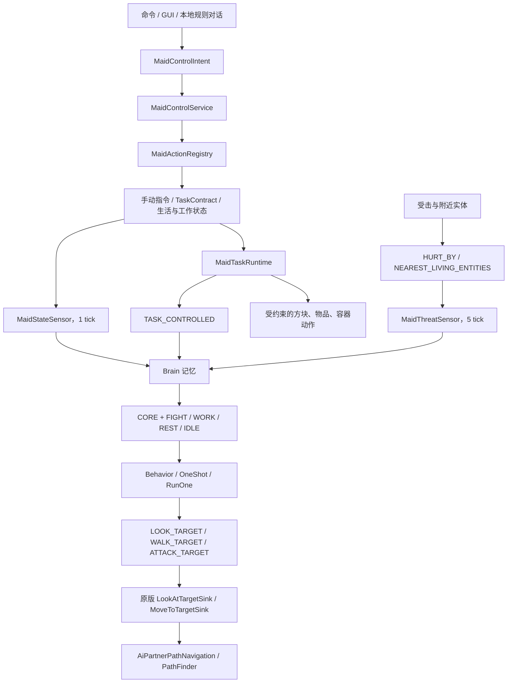

# AI Partner 0.11 架构

本文描述 Minecraft 26.1.2 对应的当前实现。旧的远程模型驱动和 `Goal` 女仆自主 AI 已删除，不再属于运行时架构。

## 1. 设计边界

项目把行为分成两类：

1. **自主生物 AI**：跟随、待命、回家、日程移动、休息、注视、游泳和战斗仲裁，由原版风格 `Brain` 驱动；
2. **有限世界任务**：采集、存箱、制作、持续工作等需要精确进度和物品守恒的动作，由服务端状态机执行。

Brain 负责“现在应该做什么”和“应该向哪里移动”；有限任务负责“这个有副作用的步骤是否真正完成”。两者通过瞬时记忆互斥，避免同时写导航。

## 2. 总体数据流



不存在客户端直接控制实体或世界的通道。客户端只提交意图；主人、实体、维度、参数和运行时状态始终由服务器复验。

## 3. Brain 生命周期

`AiPartnerEntity` 覆盖三个关键点：

- `makeBrain(Brain.Packed)`：通过 `MaidAi.brainProvider()` 创建或恢复 Brain；
- `getBrain()`：向女仆传感器和行为提供精确泛型；
- `customServerAiStep(ServerLevel)`：推进 Brain、选择 Activity，再执行父类服务端 AI。

每个服务端 tick 的顺序是：

```text
AiPartnerEntity.customServerAiStep
  ├─ Brain.tick
  │    ├─ 遗忘过期记忆
  │    ├─ tick 传感器
  │    ├─ 启动当前 Activity 中未运行的行为
  │    └─ tick 或停止运行中的行为
  ├─ MaidAi.updateActivity
  └─ super.customServerAiStep
```

Activity 在 Brain tick 后依据最新记忆更新，因此传感器刚写入的高优先级状态会在下一个 tick 启动对应行为。这与原版多个 Brain 生物的组织方式一致，也避免在同一次行为遍历中修改活动集合。

## 4. 记忆模型

### 4.1 女仆专用瞬时记忆

| 记忆 | 类型 | 主要生产者 | 主要消费者 |
|---|---|---|---|
| `FOLLOW_OWNER` | `Unit` | `MaidStateSensor` | 跟随行为 |
| `STAY_IN_PLACE` | `Unit` | `MaidStateSensor` | 待命行为 |
| `PAUSED` | `Unit` | `MaidStateSensor` | CORE 暂停、所有自主行为 |
| `TASK_CONTROLLED` | `Unit` | `MaidStateSensor` | 自主移动入口条件 |
| `AMBIENT_MOVEMENT` | `Unit` | `MaidStateSensor` | `RunOne` 空闲行为 |
| `SCHEDULE_WORK` | `Unit` | `MaidStateSensor` | `WORK` Activity 条件 |
| `SCHEDULE_REST` | `Unit` | `MaidStateSensor` | `REST` Activity 条件 |
| `ACTIVITY_TARGET` | `GlobalPos` | `MaidStateSensor` | 回家、日程地点行为 |

这些 `MemoryModuleType` 都没有 Codec，不写入 NBT。加载实体后，传感器会从手动指令、任务、生活日程和 GUI 状态重新构造它们。

### 4.2 使用的原版记忆

- `HURT_BY`、`HURT_BY_ENTITY`：记录受击上下文；
- `NEAREST_LIVING_ENTITIES`、`NEAREST_VISIBLE_LIVING_ENTITIES`：视野和附近实体；
- `ATTACK_TARGET`：当前合法战斗目标；
- `ATTACK_COOLING_DOWN`：近战或远程攻击冷却；
- `LOOK_TARGET`：注视目标；
- `WALK_TARGET`：高层移动意图；
- `PATH`：`MoveToTargetSink` 当前路径；
- `CANT_REACH_WALK_TARGET_SINCE`：首次确认目标不可达的游戏时间。

`MaidStateSensor` 比较上一个 tick 的指令、日程、暂停、任务和活动地点状态。在控制权切换时，它会清除 `WALK_TARGET`、`LOOK_TARGET` 和不可达计时，防止旧路径穿透到新状态。

## 5. 传感器

### `MaidStateSensor`

扫描周期为 1 tick。它把权威控制器状态投影成 Brain 记忆：

- 背包 GUI 打开 → `PAUSED`；
- 有限任务运行 → `TASK_CONTROLLED`；
- 跟随/待命指令 → 对应 marker；
- 日程工作/睡眠 → `SCHEDULE_WORK` / `SCHEDULE_REST`；
- 回家、工作、休闲或床位置 → `ACTIVITY_TARGET`；
- 允许普通闲逛 → `AMBIENT_MOVEMENT`。

GUI 暂停和待命会同时停止现有导航。有限任务只清理自主移动记忆，不持续调用 `navigation.stop()`，这样任务状态机可以在接管后的下一 tick 使用自己的受约束导航。

### `MaidThreatSensor`

扫描周期为 5 tick。它只接受自身受击、主人受击或主人正在攻击的合法敌对实体，不主动把中立生物变成目标。

目标复验包括：

- 战斗策略未关闭；
- 实体存活、同维度且距离不超过 24 格；
- 不是玩家、主人、自己或同阵营实体；
- 符合待命锚点或活动地点边界；
- `canAttack` 和原版阵营规则允许。

## 6. Activity 与行为

### CORE

始终激活，依次包含：

1. GUI 暂停清理；
2. `Swim`；
3. `LookAtTargetSink`；
4. `MoveToTargetSink`；
5. `InteractWithDoor`。

高层行为不直接反复调用 `navigation.moveTo`，而是写入目标记忆，由 CORE 汇接器统一推进。

### FIGHT

条件：`ATTACK_TARGET` 存在且没有 `PAUSED`。

行为：

1. 验证目标和 200 tick 不可达超时；
2. 写入追击或保持距离目标；
3. 在可见、持弓、有箭和冷却结束时远程攻击；
4. 在可见、近战范围内和冷却结束时近战攻击。

退出时清理移动、注视、不可达和攻击冷却记忆。进入 FIGHT 的第一刻也会停止旧的跟随或日程路径。武器通过 `EquipmentLease` 临时借用并在单次攻击后归还。

### WORK

条件：`SCHEDULE_WORK` 存在且没有 `PAUSED`。先前往工作地点；没有正在执行的工作且允许活动时，可以注视或闲逛。真正的种植、采矿、熔炼等世界动作仍由工作控制器执行。

### REST

条件：`SCHEDULE_REST` 存在且没有 `PAUSED`。前往睡眠地点或床，并在无移动目标时进入休息。床占用、受击冷却和恢复由生活控制器复验。

### IDLE

无额外条件，是默认活动。它承载：

- 跟随主人；
- 原地待命；
- 回家或休闲地点移动；
- 随机注视；
- 受 marker 控制的 `RandomStroll` / `SetWalkTargetFromLookTarget` / `DoNothing`。

Activity 选择顺序固定为：

```text
FIGHT → WORK → REST → IDLE
```

`CORE` 与选中的一个非核心 Activity 同时运行。

## 7. 寻路与不可达处理

移动链路是：

```text
Behavior
  → WALK_TARGET
  → MoveToTargetSink.tryComputePath
  → PathNavigation.createPath
  → PathFinder / NodeEvaluator
  → PATH 记忆
  → navigation.moveTo
```

原版 `MoveToTargetSink` 会：

- 读取目标、速度和允许接近距离；
- 为移动目标在位置变化超过 2 格后重算路径；
- 路径不能真正到达时设置 `CANT_REACH_WALK_TARGET_SINCE`；
- 无完整路径时尝试朝目标的局部随机中间点；
- 卡住后停止路径，并使用最多 40 tick 的随机重试冷却；
- 默认行为超时范围为 150–250 tick。

女仆跟随在此基础上增加：

- 超过 5 格开始追随，进入 3 格内停止，避免边界抖动；
- 超过 10 格使用更高速度；
- 至少 12 格且不可达持续 60 tick 后，调用驯服生物的原版安全主人传送；
- 传送失败按契约恢复预算计数；
- 不可达持续 200 tick 时以 `PATH_UNREACHABLE` 结束有限契约。

战斗、回家、工作、休闲和睡眠不会传送。

## 8. 有限任务与 Brain 的控制权

`MaidTaskRuntime` 仍管理 `TaskContract`、进度、恢复预算、超时和存档恢复。有限任务可能直接使用导航或执行方块、物品、容器动作，因为这些动作必须拥有确定的阶段和完成证据。

控制权规则如下：

```text
GUI PAUSED
  > FIGHT 临时中断
  > TASK_CONTROLLED 有限任务
  > 手动 FOLLOW / STAY / RETURN_HOME
  > 日程 WORK / REST
  > IDLE
```

战斗只临时覆盖显示和移动，不销毁被中断的有限任务或长期指令。目标消失后，Brain 清理 FIGHT 记忆并恢复原状态。

## 9. 本地对话

R 键界面只发送玩家输入、回退目标女仆 UUID 和长度受限的文本到服务端。服务端流程是：

```text
MaidConversationTargetResolver
  → LocalMaidIntentParser
  → MaidControlInterpretation
  → MaidControlService
  → MaidActionRegistry
```

解析器一次只产生一个类型化意图。无法确定时保留两分钟澄清上下文；不受支持的请求明确拒绝。代码中没有 HTTP 客户端、端点、模型、API Key 或远程响应处理路径。

## 10. 注册、持久化与兼容

模组初始化顺序先注册记忆模块和传感器，再注册实体。Brain Provider 会自动注册所有传感器和行为要求的原版记忆。

实体 NBT 保存：

- 驯服与主人关系；
- 背包、装备和安全迁移数据；
- 有限任务契约与快照；
- 手动指令、生活地点、日程和工作模式；
- 战斗策略、成长、好感、皮肤和显示状态。

Brain 瞬时 marker 不保存。旧版本多余字段会被忽略；物品和任务安全所需的旧格式只读迁移仍保留。

## 11. 关键源码入口

- `entity/AiPartnerEntity.java`
- `entity/ai/MaidAi.java`
- `entity/ai/MaidMovementBehaviors.java`
- `entity/ai/MaidCombatBehaviors.java`
- `entity/ai/sensing/MaidStateSensor.java`
- `entity/ai/sensing/MaidThreatSensor.java`
- `registry/ModMemoryModules.java`
- `registry/ModSensorTypes.java`
- `core/task/MaidTaskRuntime.java`
- `life/MaidLifeController.java`
- `combat/MaidCombatController.java`
- `conversation/MaidConversationService.java`
