# AI Partner v0.9 架构说明

## 1. 目标与范围

v0.9 在 v0.8 复杂工作框架上加入“制作与工作补给”。本版本不调用、不接入也不扩张 LLM 或实验能力；它把菜单内 2×2 制作、服务端原版配方规划、工作台搜索/制作/放置和各工作物资需求接入既有工作控制器，同时保留 v0.8 的自然树、暴露矿石、原版熔炉、真实钓鱼、通用物流和成长边界。

当前基础版本保留此前生命周期、工作与防御能力，并在 v0.9 正式新增：

- 持久化主人索引、可配置数量上限和多女仆选择；
- 任意原版可食用食物；
- 原生主手 + 35 格储物、护甲、副手和工具租约；
- 通用物品、箭和经验拾取，以及装备经验修补；
- 日班、夜班、全天工作；
- 工作、休闲、睡眠三个独立活动地点；
- 区域约束、步行回家、睡眠和无床休息；
- 名称、64×64 PNG 皮肤、内置声音和简单聊天气泡；
- 带冷却/每日上限的好感度和成长奖励、等级曲线与温和属性/效率增益；
- `MaidWorkMode`、`MaidWorkRegistry` 和通用工作状态机；
- 普通作物、甘蔗、瓜类、可可、花草、除雪、蜂蜜、剪毛、挤奶、喂主人、喂动物、插火把和灭火；
- 保守自然树识别与整树计划、安全暴露矿石、原版熔炉租约状态机和真实浮标钓鱼；
- `TRANSFER_ITEM` 通用物品到普通单箱的精确物流任务；
- 自卫/保护主人策略，以及根据武器、弹药和距离选择近战或弓箭；
- 战斗对有限任务、手动指令和持续工作的无损暂停/恢复。
- GUI 内服务端权威的 2×2 制作区，以及三页具体工作直选按钮；
- 仅接受普通有形/无形原版配方的递归制作规划、原子背包提交和制作剩余物处理；
- 声明式工作物资需求与独立准备状态机，可搜索现成工作台，或制作、放置并导航到工作台完成 3×3 制作；
- 徒手伐木降级，以及斧、镐、锹、剪刀、瓶、桶、火把和钓竿的自动补给。

命令型有限任务是：`FOLLOW`、`STAY`、`COLLECT_BLOCK`、`DEPOSIT_ITEM`、`TRANSFER_ITEM`、`COLLECT_AND_DEPOSIT` 和 `CANCEL`。17 种工作属于持续策略，不伪装成新的 LLM `JobType`；其中直接采集命令仍只支持橡木、白桦和云杉原木，通用物流则只移动女仆已经持有的请求物品。

## 2. 总体架构

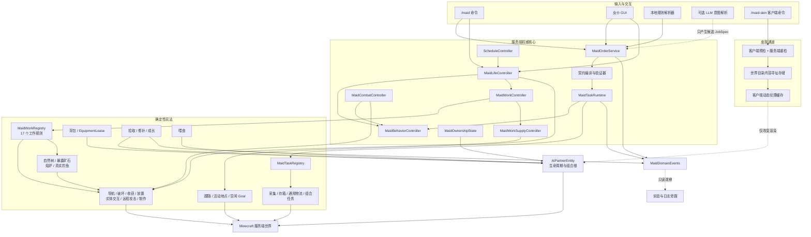

依赖保持单向：

- `core` 不导入客户端、LLM、实验、评测或日志包；
- `life` 消费日程结果，但日程计算器不依赖实体或世界；
- Goal 只消费控制器给出的目标，不拥有日程规则；
- 普通工作规则只声明目标谓词、原子动作和可选的 `WorkSupplyRequirement`；扫描、导航、冷却和地点边界由 `MaidWorkController` 统一管理，配方、工作台和制作流程由 `MaidWorkSupplyController` 管理；熔炉、钓鱼通过同一规则接口管理自己的多阶段执行，但仍接受统一仲裁和边界暂停；
- 战斗只写临时中断投影，不销毁 `MaidTaskRuntime` 的活动契约和快照；
- 客户端 GUI 和皮肤命令不能直接修改权威实体字段；
- 实验系统只能订阅领域事件，不能参与行为决策。

## 3. 主要模块

| 模块 | 主要类型 | 职责 |
|---|---|---|
| 实体组合根 | `AiPartnerEntity` | 原版实体生命周期、装备、交互、同步字段和控制器组合 |
| 行为仲裁 | `MaidBehaviorController` | 手动指令、有限任务模式、日程背景模式和 GUI 暂停 |
| 日程计算 | `ScheduleWindows`、`ScheduleController` | 无世界副作用地计算活动和下一次转换 |
| 生活控制 | `MaidLifeController` | 活动地点、回家、区域约束、睡眠和长期目标 |
| 生活配置 | `MaidLifeProfile`、`ActivityLocation` | 日程、地点、默认家和半径持久化 |
| 持续工作 | `MaidWorkController`、`MaidWorkMode` | 有界扫描、导航、动作前复验、冷却和工作模式持久化 |
| 工作注册 | `MaidWorkRegistry`、`MaidWorkRule` | 工作模式到规则的冻结映射，隔离具体玩法与实体 |
| 工作物资准备 | `MaidWorkSupplyController`、`WorkSupplyRequirement` | 2×2 尝试、工作台搜索/制作/放置、导航和 3×3 制作 |
| 农务规则 | `AgricultureWorkRules` | 作物、甘蔗、瓜类、可可、花草和除雪 |
| 照料规则 | `AnimalCareWorkRules` | 蜂蜜、剪毛、挤奶、喂主人和动物繁殖 |
| 环境规则 | `EnvironmentWorkRules` | 插火把和灭火 |
| 复杂规则 | `ComplexWorkRules`、`NaturalTreeAnalyzer`、`MiningSafety` | 整树计划与玩家结构排除、安全暴露矿石判定 |
| 熔炉状态机 | `FurnaceWorkRule`、`WorkstationLeaseRegistry` | 配方/燃料选择、原版熔炉租约、批次守恒和重启恢复 |
| 钓鱼状态机 | `FishingWorkRule`、`FishingSiteGeometry`、`MaidFishingHookEntity` | 岸线选择、真实浮标、咬钩、收竿和掉落拾取 |
| 防御中断 | `MaidCombatController`、`CombatPolicy` | 合法威胁选择、战术选择、暂停与恢复 |
| 战斗 Goal | `AiPartnerMeleeCombatGoal`、`AiPartnerRangedCombatGoal` | 追击、攻击节奏和武器租约 |
| 公共动作 | `MaidActions` 及 `core.action` | 原版掉落、耐久、背包预演、放置、交互、真实箭实体和配方制作 |
| 制作动作 | `CraftItemAction` | 服务端配方索引、递归中间材料规划、网格约束和影子背包原子提交 |
| 主人索引 | `MaidOwnershipState`、`PartnerService` | UUID 索引、数量上限、生成、查找和选择 |
| 任务运行时 | `MaidTaskRuntime` | 唯一活动契约、暂停、终态、恢复和任务替换 |
| 背包迁移 | `MaidInventoryPersistence` | 新布局保存和 v0.4/v0.5 压缩背包迁移 |
| 工具租约 | `EquipmentLease` | 在主手和储物槽之间安全交换任务工具 |
| 后台拾取 | `MaidPickupController` | 物品、箭、经验球、经验修补和成长经验 |
| 成长控制 | `MaidGrowthController`、`MaidGrowthProgression` | 奖励限额、等级曲线、属性与工作效率投影 |
| 通用物流 | `TransferItemMaidTask`、`DepositItemContractValidator` | 任意已注册物品的权限/容量验证和精确单箱转移 |
| 喂食 | `MaidFeedingService` | 原版食物/食用组件、效果、容器返还、恢复和好感 |
| 玩法配置 | `MaidGameplayConfig` | 独立于 LLM 的服务端生活参数 |
| 皮肤安全 | `SkinImageValidator`、`MaidSkinStore`、`MaidSkinNetworking` | 校验、重编码、持久化和追踪同步 |
| 客户端皮肤 | `MaidSkinClient`、`SkinTextureCache` | 本地文件读取和动态纹理生命周期 |

## 4. 行为仲裁与状态投影

权威状态不再由一个枚举承担。v0.9 继续使用七个正交维度；制作输入和工作补给阶段均为可安全重算的瞬时状态，不增加持久化行为维度：

| 状态 | 保存位置 | 是否持久化 | 作用 |
|---|---|---:|---|
| `ManualDirective` | `MaidBehaviorController` | 是 | FOLLOW、STAY、RETURN_HOME |
| 活动有限任务 | `MaidTaskRuntime` | 是 | 采集、存箱、组合任务 |
| 当前日程活动 | `MaidLifeController` | 是 | WORK、LEISURE、SLEEP |
| `MaidWorkMode` | `MaidWorkController` | 是 | WORK 时段内持续选择下一项基础工作 |
| `CombatPolicy` | `MaidCombatController` | 是 | OFF、SELF_DEFENSE、DEFEND_OWNER |
| 临时战斗中断 | `MaidBehaviorController` | 否 | 暂停底层任务并投影 FIGHTING |
| `inventoryMenuOpen` | `MaidBehaviorController` | 否 | 临时暂停导航和任务计时 |

`PartnerMode` 只是同步给客户端、命令和旧存档的有效投影。固定优先级为：

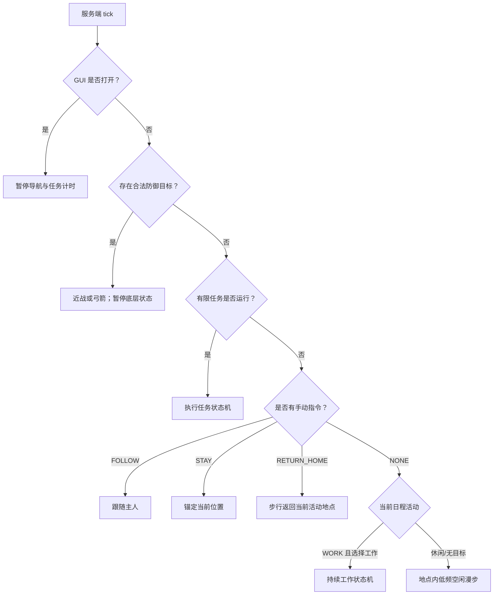

日程时钟即使被任务或手动指令覆盖仍会继续推进；覆盖结束后，下一 tick 直接恢复当前正确活动，不重放已经错过的阶段。

### 4.1 状态转换

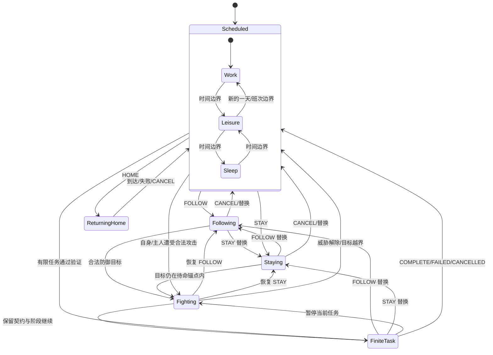

GUI 暂停是覆盖层，不是上述持久化状态之一；关闭 GUI 后从原状态继续，并由任务或生活控制器重新检查世界条件。

### 4.2 防御中断与战术选择

`MaidCombatController` 不做无条件敌对扫描，只读取女仆和主人的原版受伤/攻击记忆。自动目标始终排除玩家、主人、同主女仆、同主驯服动物、盟友、死亡目标和区域外目标。`SELF_DEFENSE` 仅响应女仆受到的攻击；`DEFEND_OWNER` 还响应主人受到的攻击，以及主人刚攻击过的敌对生物。

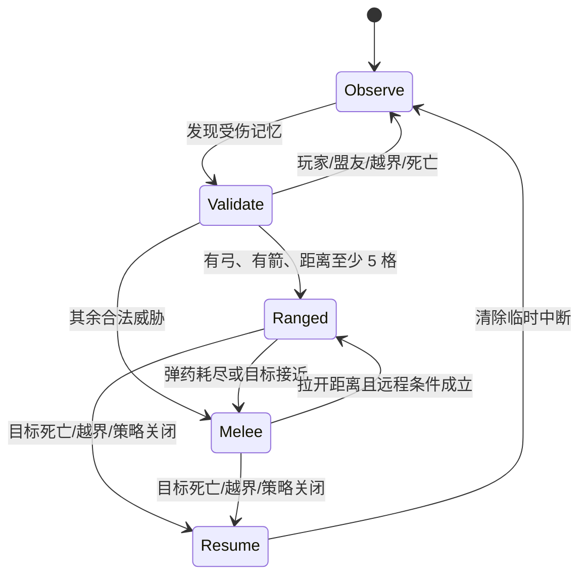

弓和剑/斧通过 `EquipmentLease` 临时进入真实主手。远程攻击生成真实 `AbstractArrow`，使用箭种、弹药消耗附魔、弓耐久和原版射弹碰撞；近战使用实体攻击属性、主手武器与原版攻击耐久。战斗期间 `MaidTask.pauseForTick()` 延长任务截止时间，任务对象、契约状态和快照均不被替换。

### 4.3 持续工作状态机

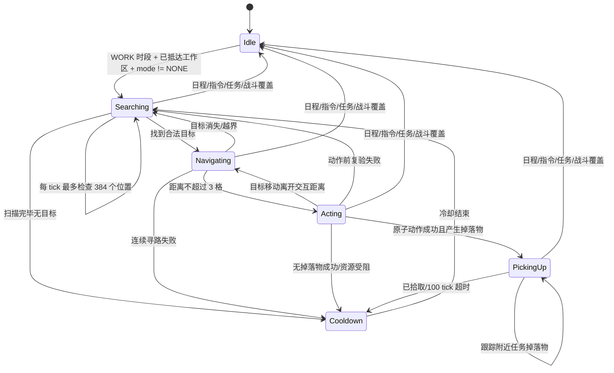

工作边界始终来自 `workLocation`，未配置时回退到生成时默认家位置。扫描只读取已加载区块，垂直范围最多 6 格，所有动作在发生的同一个服务端 tick 再验证目标、地点、工具和背包；只有会修改方块/流体的规则额外要求 `mobGriefing`。破坏方块后，`PickupItemAction` 只跟踪动作位置附近的真实掉落实体，最终物品插入仍由实体统一的 `InventoryCarrier` 拾取路径完成。普通扫描游标、动作位置和临时掉落目标可安全重算，因此不写入 NBT；整树批准列表、熔炉批次最小稳定阶段和必要冷却会持久化。

### 4.4 复杂工作状态机

自然树和矿石继续复用通用工作状态机，但在目标匹配前增加保守批准策略：

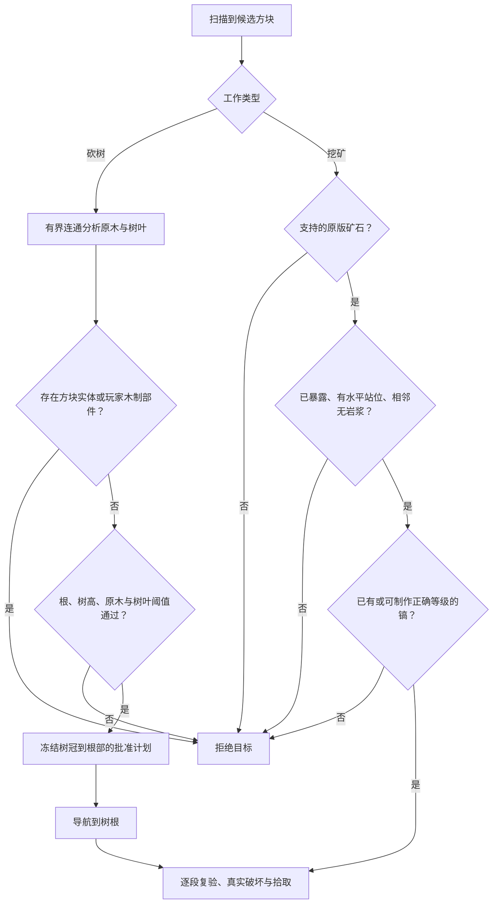

熔炉规则拥有可持久化的批次状态机，并用 `(维度, 方块位置)` 工作站租约阻止多个女仆同时管理同一熔炉：

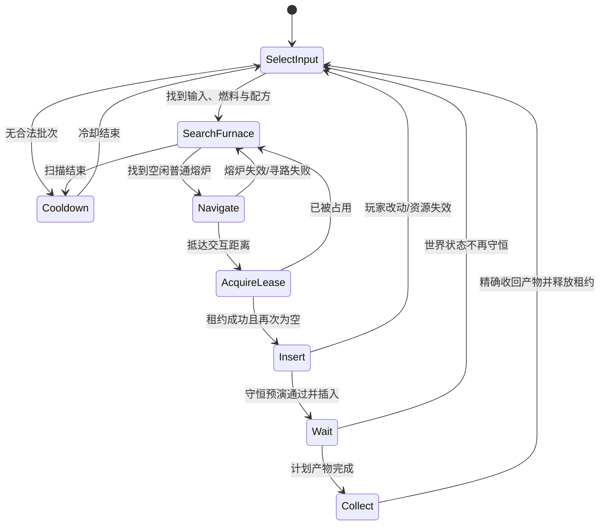

钓鱼规则使用真实 `FishingHook` 子类；保存时不持久化瞬时浮标 UUID，重启后从安全搜索阶段恢复，避免幽灵浮标：

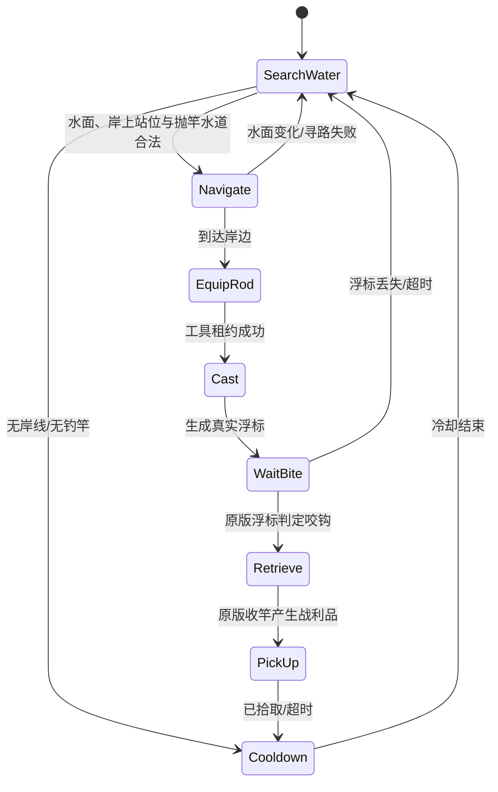

### 4.5 制作与工作物资准备状态机

`MaidWorkRule` 可以返回一个 `WorkSupplyRequirement`，只包含稳定键、当前是否已满足、候选制作产物和是否允许降级。具体规则不读取配方，也不搜索或放置工作台。`MaidWorkController` 在导航和动作前把需求交给独立控制器：

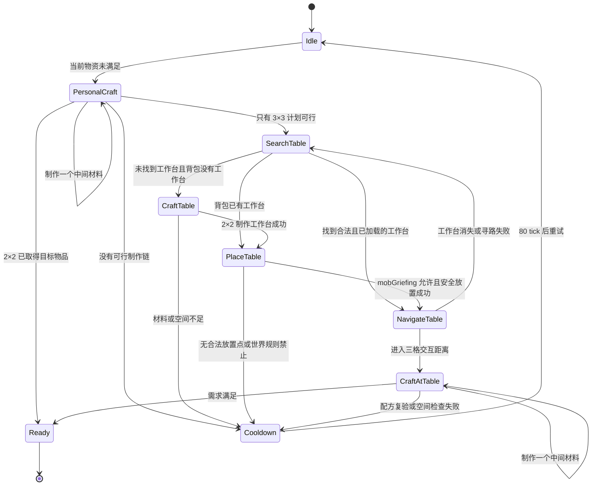

`CraftItemAction` 每次 tick 最多提交一个普通 `ShapedRecipe` 或 `ShapelessRecipe`。规划深度上限为 7，单个原料最多尝试 64 个标签候选；规划只维护物品计数，执行时复制 35 格储物为影子容器，重新移除真实原料、调用原版 `matches/assemble/getRemainingItems`，确认产物与剩余物都能完整放入后才整体写回。因此计划过期、配方变化或背包在途中改变不会造成半次制作或吞物。

个人 2×2 与工作台 3×3 使用相同动作，但严格检查配方宽高/原料数。当前不执行烟花、地图复制等特殊动态配方，也不覆盖切石机、锻造台、熔炉或模组自定义配方类型。工作台搜索只读取工作地点边界内已加载区块；自动放置要求合法边界、稳固支撑、无碰撞并遵守 `mobGriefing`。准备阶段、扫描游标和临时工作台目标不持久化，暂停、重启或目标变化后从需求重新计算。

伐木是唯一允许无工具降级的当前规则：无法取得斧头时临时清空主手并徒手破坏，成功冷却从 20 tick 增至 60 tick。挖矿、除雪、剪毛/采蜜、挤奶和钓鱼等规则不伪造工具；材料不足时保持安全冷却，材料到达后重新规划。

## 5. 日程系统

默认一天使用原版 24000 tick 时钟：

| 世界时间 | 日班 | 夜班 | 全天工作 |
|---:|---|---|---|
| 0–11999 | 工作 | 睡眠 | 工作 |
| 12000–13999 | 休闲 | 休闲 | 工作 |
| 14000–21999 | 睡眠 | 工作 | 工作 |
| 22000–23999 | 休闲 | 休闲 | 工作 |

边界可在 `ai-partner-gameplay.json` 中配置，但必须严格递增并落在同一天内。全天工作没有伪造的“下一次切换”，GUI 显示为持续工作。

三个活动分别对应独立地点：

- `WORK` → 工作地点；
- `LEISURE` → 休闲地点；
- `SLEEP` → 睡眠地点。

地点保存维度、方块坐标和半径。未单独配置时回退到生成/绑定时记录的默认家位置。修改全局活动半径会同步更新默认家和三个已配置地点。

### 5.1 区域约束与回家

- `homeBound=true` 时，工作和休闲会把原版限制中心设为对应地点；
- 睡眠无论 `homeBound` 是否开启，都会尝试返回睡眠地点；
- `/maid home` 和 GUI“回活动地点”会取消现有任务，然后只通过寻路返回；
- 活动地点位于其他维度时立即结束回家指令并提示，不会跨维度传送；
- STAY 使用独立的当前位置锚点，不会覆盖三个日程地点；
- FOLLOW 和有限任务运行时临时解除 home restriction，结束后由日程重新建立。

只有 FOLLOW 可以在距离较远且持续卡住后调用原版安全传送。RETURN_HOME、WORK、LEISURE 和 SLEEP 永远不传送。

### 5.2 睡眠状态机

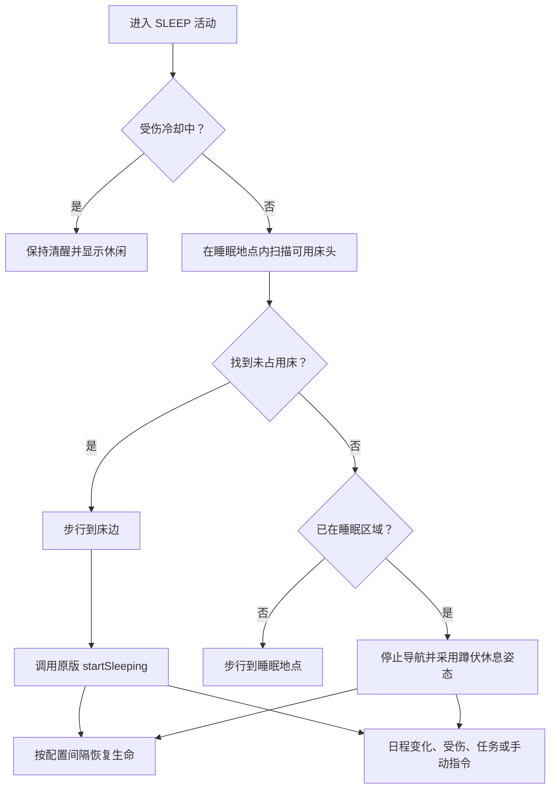

床位每 100 tick 重扫，且只检查已加载区块；受伤后默认 200 tick 内不会重新入睡。

## 6. 主人与多女仆选择

原版驯服主人 UUID 仍是所有权事实来源，`MaidOwnershipState` 只是跨重启索引：

```text
owner UUID -> 有序 maid UUID 集合 + selected maid UUID
```

- 默认每位主人最多 1 名，可配置为 1–32；
- `/maid spawn` 在玩家附近检查边界、支撑面、流体和碰撞后生成；
- `/maid list` 列出当前已加载女仆；
- `/maid select <UUID前缀或唯一名称>` 设置后续命令目标；
- 命令优先使用已选择且已加载的女仆，否则回退到同维度优先、距离最近的已加载女仆；
- 实体死亡或其他破坏性移除时从索引注销，卸载区块不会误注销。

索引保留未加载女仆，以防通过卸载区块绕过数量上限；因此普通命令不会强制加载区块。

## 7. 背包、装备与迁移

### 7.1 新布局

| GUI 槽位 | 权威存储 | 数量 |
|---|---|---:|
| 物品区第 0 格 | 原生 `EquipmentSlot.MAINHAND` | 1 |
| 物品区第 1–35 格 | `SimpleContainer` | 35 |
| 护甲 | 原生 HEAD/CHEST/LEGS/FEET | 4 |
| 副手 | 原生 OFFHAND | 1 |

因此“36 格背包”是玩家式的 1 个主手入口加 35 格储物，护甲和副手额外计算。任务存箱只转移储物区物品，不会意外存走当前主手工具。

### 7.2 v0.4/v0.5 迁移

旧版 `Inventory` 是不保存空槽位置的 36 项压缩列表。v0.6 迁移规则为：

1. 旧列表第一项迁入原生主手；
2. 其余项目按原顺序进入 35 格储物；
3. 如果实体已有原生主手，旧第一项尝试进入储物；
4. 无法容纳的冲突物品不丢弃，在实体进入服务端世界后显式掉落；
5. 新版使用 `MaidStorage` 子结构保存精确槽位；
6. 加载后只写新格式，不继续制造旧压缩列表。

### 7.3 EquipmentLease

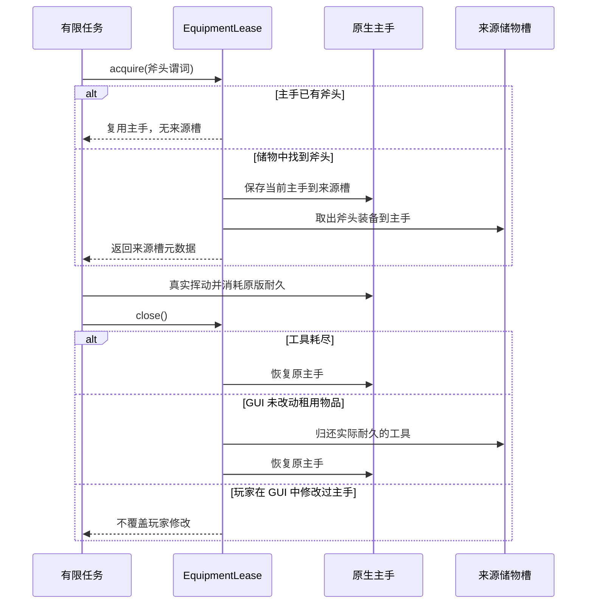

租约来源槽写入任务快照，服务器重启后可以恢复交换关系。采集转入存箱阶段时立即归还斧头。

## 8. 拾取、修补、喂食和成长

### 8.1 后台拾取

- `ItemEntity` 使用原版 `InventoryCarrier` 部分插入语义；
- 落地且允许拾取的箭在 1.5 格范围内进入储物；
- 经验球按原版合并球计数逐个消费；
- 经验优先随机修补已装备且带修补效果的损坏物品；
- 剩余经验进入 `MaidGrowthData`；
- STAY 和 homeBound 会限制后台拾取位置，FOLLOW 和有限任务可临时解除活动区限制；
- GUI 打开时停止后台拾取，避免与容器操作竞争。

### 8.2 喂食

只有同时带原版 `FOOD` 和 `CONSUMABLE` 组件的物品才被接受。系统在服务端用一份单物品副本调用原版 `finishUsingItem`，因此药水效果、负面效果和容器返还仍遵循原版；女仆额外按营养值恢复生命。

食物默认每 1200 tick 最多增加 1 点好感。好感上限 1000；喂食、持续工作和合法战斗奖励分别具有服务端冷却与每日次数上限，防止自动化刷取。首次完成每种工作提供一次额外成长经验，经验球完成修补后的剩余经验也进入成长。

等级按 `1 + floor(sqrt(experience / 25))` 计算并限制为 1–20 级。每级温和增加 0.5 最大生命、0.2 攻击和 0.0025 移动速度；工作冷却减免上限 25%，每 5 个成长级额外增加一次寻路重试。等级只改善效率，不锁定任何基础或复杂工作；加载存档和升级后由服务端重新投影原版属性，并按比例保持当前生命。

## 9. 名称、皮肤、声音与气泡

### 9.1 皮肤上传

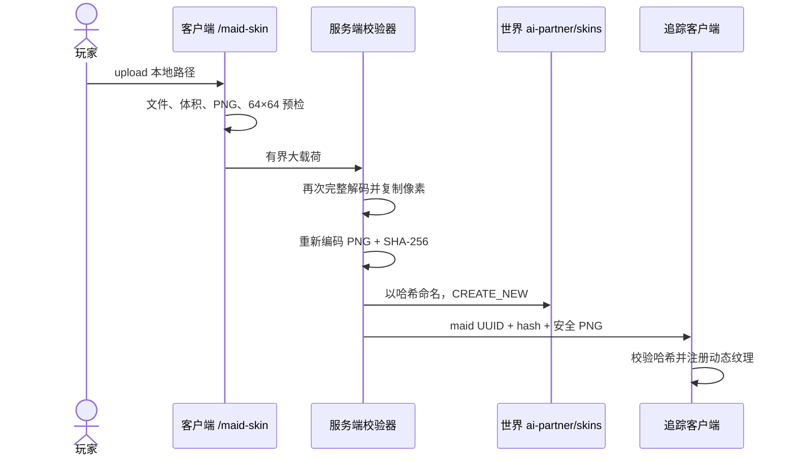

安全边界：

- 最大上传体积 256 KiB；
- 必须具有 PNG 签名并能完整解码；
- 尺寸必须严格为 64×64；
- 服务器不信任客户端预检，会重新解码、复制像素并重编码以剥离元数据；
- 实体 NBT 只保存 64 位十六进制哈希，大字节存放在当前世界目录；
- 只向追踪该实体的客户端和上传者同步；
- 当前所有自定义皮肤都按 Alex 瘦臂模型渲染。

### 9.2 声音和气泡

当前“语音”是无需额外资源包的原版 Allay 短音效反馈，不是可配置语音包。聊天气泡通过实体同步组件和过期 tick 渲染为名称上方的短文本；喂食、任务开始/完成/失败和日程切换会触发。

## 10. GUI 与命令

潜行右键打开的菜单由服务端真实容器和 17 项 `ContainerData` 驱动，显示：

- 主手、35 格储物、护甲、副手和玩家背包；
- 四格瞬时制作输入和一个服务端同步结果槽，关闭菜单时未使用原料按原版容器规则返还玩家；
- 生命、有效模式、任务和契约状态；
- 日程类型、当前活动和下次转换；
- homeBound、活动半径和三个地点是否单独配置；
- 好感度、成长等级和经验；
- 当前持续工作模式和防御策略；
- 跟随、待命、取消、回家、切换日程、地点设置/清除、半径、工作模式和防御策略按钮；
- 生活/日程与具体工作的侧栏切换，以及每页六项、共三页的 17 种工作和 `NONE` 直选按钮。

生活命令：

```text
/maid spawn
/maid list
/maid select <maid>
/maid name <name>
/maid follow
/maid stay
/maid home
/maid cancel
/maid schedule day|night|all-day
/maid location set|clear work|leisure|sleep
/maid home-bound <true|false>
/maid radius <radius>
/maid work <mode>
/maid combat <policy>
/maid status
/maid inventory
/maid retrieve
/maid-skin upload <local path>
/maid-skin clear
```

`/maid-skin` 是客户端命令；其余是服务端命令。带任务语义的命令和 GUI 按钮仍通过 `MaidOrderService`，纯生活配置直接调用拥有者已验证的实体 API。

## 11. 持久化格式

`AiPartnerDataVersion = 4`。v0.9 没有新增需要持久化的数据；制作网格与物资准备状态均为瞬时状态。v0.8 复杂工作、成长字段与既有生活字段如下：

```text
MaidStorage/*
ScheduleType
CurrentScheduleActivity
HomeBound
ActivityRadius
DefaultHomeDimension / Position / Radius
ActivityLocationWORK*
ActivityLocationLEISURE*
ActivityLocationSLEEP*
StayAnchor*
SleepBlockedUntil
MaidAffection
MaidGrowthExperience
MaidCompletedWorkMask
GrowthRewardDay
LastWorkGrowthReward / LastCombatGrowthReward / LastFoodGrowthReward
WorkGrowthRewardsToday / CombatGrowthRewardsToday / FoodGrowthRewardsToday
LastFoodAffectionGameTime
MaidSkinHash
SelectedWorkMode
CombatPolicy
ComplexTreePlanCount / ComplexTreePlanPosition*
ComplexFurnace*
ComplexFishingCooldown
```

主人索引使用世界级 SavedData，不写进单个实体。皮肤文件存于：

```text
<world>/ai-partner/skins/<sha256>.png
```

v0.5 的契约、任务快照和兼容字段继续读写。`TRANSFER_ITEM` 使用独立任务 ID 和版本化快照，但复用通用存箱执行器。生活配置和有限任务彼此独立，因此任务重启恢复不会覆盖日程地点，日程切换也不会重置任务进度。熔炉状态加载后不会盲信保存数据，会在下一服务端 tick 复验维度、熔炉、租约、配方与物品守恒。

## 12. 线程与安全边界

- 实体、日程、导航目标、背包、契约和皮肤应用都在服务器线程修改；
- LLM HTTP 仍在外围异步执行，结果回到服务器线程后才进入订单服务；
- 客户端只上传候选字节和发送白名单按钮 ID；
- GUI 的 `ContainerData.set` 不反向修改实体；
- 2×2 结果只由服务端配方管理器计算并通过容器槽同步；自动制作也只在服务器线程执行；
- 皮肤网络载荷有显式字节上限；
- 所有活动地点带维度，跨维度只安全停止，不推测传送目的地；
- 工作只在 `ScheduleActivity.WORK` 且实体与目标都位于工作地点半径内推进；
- 工作扫描有每 tick 预算，只检查已加载区块；会修改世界的规则在动作 tick 复验 `mobGriefing`，只管理现有熔炉或原版钓鱼的规则不受无关门禁影响；
- 配方规划深度、原料候选数和工作台扫描均有硬上限；制作先在影子背包完整复验，再一次性提交，不接受客户端指定配方或产物；
- 自然树计划最多包含 64 段原木并拒绝邻接玩家木制组件；矿石必须已暴露、有安全水平站位且相邻无岩浆；
- 熔炉租约仅存在于服务端内存，存档租约 ID 必须在重启后重新取得；任何不守恒的玩家改动都会触发释放或重规划，不覆盖玩家物品；
- 钓鱼浮标只接受所属女仆驱动，并在工作暂停、模式切换、实体移除或重启恢复时清理/重建；
- 自动战斗不以玩家为目标，不跨活动边界追击，STAY 只在待命锚点内自卫；
- 蜂巢只在营火烟雾保护下采集，避免无玩家交互来源时错误模拟蜂群仇恨；
- 只有 FOLLOW Goal 可调用安全传送；
- 死亡会失败当前任务、注销主人索引，并按原版掉落主手、副手、护甲和储物物品；
- 打开 GUI 时有限任务、生活导航和后台拾取暂停，关闭后重新检查条件。

## 13. 测试与验收

当前 86 项单元测试包括：

- 日班、夜班、全天工作全部时间边界和日循环；
- 日程窗口非法配置；
- 主人索引注册、选择、注销和编解码；
- 旧 36 格压缩背包迁移、新 35 格储物往返和冲突溢出；
- 64×64 PNG、错误尺寸、错误签名和元数据重编码；
- 好感/经验边界、等级曲线、属性效果、工作冷却和奖励首完成位图；
- 菜单动作 ID 白名单和 RETURN_HOME 指令解析；
- 制作网格 2×2/3×3 边界、菜单槽位分区和具体工作按钮编号白名单；
- 17 个具体工作模式全部具有唯一注册规则，并区分是否需要 `mobGriefing`；
- 自然树阈值与玩家结构拒绝、熔炉批次守恒和工作站租约；
- 钓鱼岸上站位、水道对齐和距离边界；
- 通用物流任务定义、契约形状和任务注册映射；
- 工作模式/防御策略的命令名、循环顺序和未知存档回退；
- 带命名空间资源标识符的正式采集命令回归；
- v0.5 既有解析器、契约、任务快照和冻结数据回归。

完整 `build` 会同时编译服务端、客户端、Mixin 和测试。v0.9 已启动真实开发客户端，在真实服务端世界 tick 中验收菜单分页与具体工作直选、手动 2×2 原木转木板、无工具徒手伐木、无现成工作台时制作/放置工作台并制作木斧、个人制作剪刀后剪毛，以及利用已有工作台制作石镐并采煤。首次实机检查发现宽面板被窗口裁切，随后改为固定宽度分页侧栏并复验；详细过程见 [V0_9_GAME_TEST_REPORT_ZH.md](./V0_9_GAME_TEST_REPORT_ZH.md)。v0.8 的复杂工作验收仍见 [V0_8_GAME_TEST_REPORT_ZH.md](./V0_8_GAME_TEST_REPORT_ZH.md)。覆盖全部方块/实体变体的自动 GameTest 仍计划放在稳定性里程碑，单元测试不冒充游戏内集成测试。

## 14. 当前明确不做

v0.9 不包含：

- 自动开隧道、竖井、危险区探索或通用方块采掘；
- 双箱、木桶、潜影盒、模组容器或自动物流网络；
- 自动建造钓鱼台、修改岸线或跨维度工作；
- 任意物品的自由目标规划、配方书 UI、特殊动态配方、切石/锻造或模组配方兼容；
- 基于好感/等级的能力锁、关系剧情或长期记忆；
- 宽臂皮肤选择、自定义模型、动画或语音包；
- 跨维度任务和跨维度回家；
- 祭坛、东方战斗、P 点、弹幕、饰品、复活/运输、娱乐设施、自动化设施或模组兼容层。

v0.10 将集中处理自动 GameTest、长时间运行、性能预算、存档迁移审计和论文前行为冻结。长期路线见 [FOUNDATION_ARCHITECTURE_ROADMAP_ZH.md](./FOUNDATION_ARCHITECTURE_ROADMAP_ZH.md)。

## 15. 冻结实验说明

v0.4 的数据、Prompt、Schema、场景和结果仍保持原样。v0.9 是基础模组开发版本，实体、运行时、工作补给和世界动作字节码已经变化，因此不应把它直接当成 v0.4 冻结实验的等价执行制品。v0.9 的开发和实机验收均未调用 LLM；下一轮论文实验必须在玩法地基稳定后重新冻结候选、实现指纹和预注册边界。
