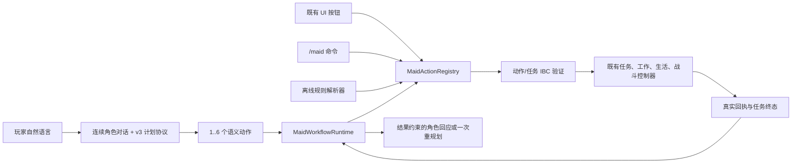

# 会聊天、会观察、会按顺序操作既有能力的 LLM 女仆

本文档描述当前自然语言模块的生产实现。旧的 v0.4 冻结实验仍保留作历史兼容，但不再定义当前玩法架构或后续论文实验。

## 1. 系统边界

LLM 只负责两件事：

1. 依据有限对话历史和服务器状态生成角色回应；
2. 从现有语义动作白名单中提出最多 6 步的有序计划。

LLM 不获得按钮编号、任意命令、坐标、NBT、代码、逐 tick 导航或直接世界修改能力。实际执行始终由服务器上的既有女仆控制器完成。



## 2. 与 UI、命令完全相同的动作入口

`MaidActionRegistry` 是唯一的语义动作执行入口。UI 的循环按钮先在服务器上解析为明确目标值，例如“切换日程”会变成 `SetSchedule(NIGHT_SHIFT)`，再进入注册表；LLM 不会看到容易随界面变化的按钮 ID。

注册表覆盖以下全部 `MaidControlIntent`：

- 有限任务或指令：`RUN_TASK`；
- 工作、日程、战斗策略；
- 回家、活动地点、回家约束、活动半径；
- 改名；
- 状态、背包查询和取回背包。

每次调用都返回服务器生成的 `MaidControlDecision`，明确区分：

- `REJECTED`：没有开始该动作；
- `COMPLETED`：目标状态已经由服务器复验；
- `RUNNING`：关联的任务契约仍在执行，并携带其 UUID。

计划运行时只相信这张回执和后续任务契约终态，不读取模型对成功与否的陈述。

## 3. v3 对话与计划协议

模型根对象固定为：

```json
{
  "schema_version": "3.0",
  "dialogue_act": "PROPOSE_PLAN",
  "plan": [
    {"kind": "SET_WORK_MODE", "mode": "none"},
    {
      "kind": "RUN_TASK",
      "job_type": "COLLECT_BLOCK",
      "target": "minecraft:oak_log",
      "quantity": 8,
      "radius": 16
    },
    {
      "kind": "RUN_TASK",
      "job_type": "DEPOSIT_ITEM",
      "target": "minecraft:oak_log",
      "quantity": 8,
      "radius": 16
    }
  ],
  "response_text": "好，我先停下日常工作，收集八块橡木，再把它们放进附近的箱子。"
}
```

`response_text` 与计划同时存在，因此角色可以先自然回应，再执行。`ASK_CLARIFICATION`、`REJECT_UNSUPPORTED` 和 `SOCIAL_REPLY` 必须使用空计划。JSON Schema 与 Java codec 使用同一组差分语料测试，额外字段、协议外动作、无界参数和超过 6 步的计划都会整体拒绝。

服务器还按请求阶段施加第二层形状约束：初始玩家消息允许普通对话或 1～6 步计划，失败重规划必须是 `PROPOSE_PLAN`，终态叙述必须是 `SOCIAL_REPLY + plan=[]`。模型若只违反协议形状，网关最多进行 1 次有界协议修复；仍失败时使用由真实事件生成的角色化兜底句，不把模型输出当作执行结果。

重规划还受“未完成目标保持”契约约束：原计划中尚未由真实回执完成的动作，必须以参数完全相同、顺序不变的形式出现在替代计划中。模型可以增加查询或准备动作，但不能删掉、降量、换目标或重排义务；计划耗尽时若仍有未完成目标，工作流以 `CONTRACT_VIOLATION` 失败，绝不会把“完成了另一个较容易的替代动作”包装成原任务成功。该义务列表与游标、证据一起持久化，旧格式存档会从当前游标安全迁移。

## 4. 有界工作流

`MaidWorkflowRuntime` 的执行规则如下：

1. 持久化计划 UUID、主人 UUID、原始请求、步骤、当前游标、期限、重规划预算、关联任务契约和证据；
2. 同一时刻只派发一个步骤；
3. 即时动作必须通过后置谓词才推进；
4. 有限任务必须等对应 `TaskContract` 进入 `COMPLETED` 才推进；
5. 失败时最多请求一次 LLM 重规划；替代计划仍受同样的 6 步白名单与剩余总期限约束；
6. `FOLLOW` / `STAY` 是持续行为，只能作为计划末步；
7. 外部 UI 或命令的变更动作会显式中断当前计划及其拥有的活动任务，避免旧计划稍后继续修改状态；只读查询不会中断；
8. 服务器重启后从存档中的游标与真实任务契约继续，而不是让模型猜测之前做到哪里。

## 5. IBC 覆盖

当前有三层契约：

| 层 | 前置条件 | 目标谓词 | 运行时不变量 | 持久化边界 |
|---|---|---|---|---|
| 语义动作 | 女仆存活、主人、同维度、参数范围 | 请求状态已观察、查询结果已生成或任务契约已接受 | 主人和维度未改变 | 工作流保存动作 JSON 与回执证据 |
| 工作流 | 1..6 个已注册动作、主人绑定、持续指令只能末步 | 全部步骤依次得到真实完成结果 | 单步串行、600 秒总期限、最多 1 次重规划 | UUID、步骤、游标、期限、预算、任务 UUID、证据 |
| 有限任务 | 任务专属工具、目标、容量、权限和世界规则 | 真实背包增量或实际搬运计数达到数量 | 主人在线、维度、持久化执行原点、精确半径、`mobGriefing`、工具 | 完整谓词、失败策略、主人、维度、原点、执行器快照 |

任务完成不再只依赖执行器回调。`MaidTaskRuntime` 会在把契约标成 `COMPLETED` 前独立检查采集增量、存箱数量，以及组合任务的采集和存箱两段证据。契约原点也写入存档；重启后搜索和半径监控继续使用原原点。

## 6. 连续对话和结果约束

每个女仆持久化最近 12 条、每条最多 512 字符的用户/助手消息。不会保存 API Key、HTTP 原始请求或模型原始响应。

模型请求分为三种服务器声明的类型：

- `PLAYER_MESSAGE`：生成自然回应和初始计划；
- `WORKFLOW_REPLAN`：接收失败码、步骤游标和服务器证据，只提出一次替代计划；
- `WORKFLOW_OUTCOME`：计划必须为空，只能依据完成/失败事件继续对话。

终态聊天由服务器在消息前加入“已验证完成”或“已验证失败”的权威标记。模型不可提前把“准备做”描述成“已经完成”。如果结果对话请求失败，服务器仍会发送确定性的真实终态，不影响游戏执行。

## 7. 完全离线兼容

- 默认/可选 `LOCAL` 驱动不发出网络请求，继续使用同一个动作注册表和全部原有 UI、命令、任务与工作能力；
- 即使女仆被配置为 `LLM`，模型端点未就绪时，确定性规则能够识别的控制请求会自动走离线降级；
- LLM 异步请求、对话记忆和工作流不是女仆实体、UI、命令或任务执行器的启动依赖；
- 关闭网络或不配置 API Key 时，模组仍可完整运行，只是不具备开放式生成对话和复杂自然语言规划。

## 8. 验证命令

```powershell
.\gradlew.bat test
.\gradlew.bat build
.\gradlew.bat runClient
```

自动测试覆盖 v3 Schema/codec 对齐、全部 sealed intent 的动作契约覆盖、计划上限和持续指令位置、重规划目标保持、分阶段响应约束、对话记忆边界、任务契约执行锚点往返，以及原有任务、工作、GUI、背包和实验兼容测试。真实客户端测试应覆盖 UI/命令离线路径、复杂计划的逐步推进、失败重规划、终态角色回应和保存重进。
