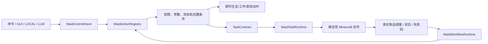

# AI Partner 全项目 Review（2026-07-22）

## 1. 结论

项目的现行主干不是旧论文实验，而是“类型化语义动作 + 服务端 IBC + 有限任务运行时 + 有界 LLM 工作流”的玩法系统。核心分层总体成立：客户端和模型没有直接世界写权限，有限任务有持久化契约与真实结果检查，生活、工作、战斗、背包和成长也已拆为独立控制器。

本轮最重要的结果是消除了两套已经互相冲突的控制架构。旧 v0.4 研究运行时曾与现行 v3 流程并存，还能通过持久化实验变体关闭运行时监控或恢复；现在生产代码只保留一条权威执行链，安全检查不再可由历史实验状态切换。

静态审查和当前自动测试没有发现仍需阻止构建的 P0 问题，但发布质量还受 Minecraft 集成测试不足限制，不能只凭单元测试宣称世界内行为已经稳定。

## 2. 审查范围

清理后的代码规模约为：

- 157 个服务端/通用 Java 文件，约 1.7 万行；
- 8 个客户端 Java 文件，约 1100 行；
- 37 个 JUnit 测试类；
- 现行资源仅保留双语文本、v3 Prompt、v3 JSON Schema、模组元数据和 Mixin 配置。

本轮工作区共涉及 130 个路径：删除 68 个受 Git 跟踪的旧文件，修改 61 个现行文件，并新增本报告；合计约新增 572 行、删除 13236 行，净减少约 1.27 万行。另移除了未跟踪的 Python 缓存、实验产物和约 11 MB 的历史运行日志。

审查覆盖初始化、命令、网络载荷、自然语言驱动、动作注册、契约编译、任务与工作流持久化、实体调度、背包装备、生活日程、17 种工作、战斗、成长、皮肤、配置和测试边界。

## 3. 现行调用链

这条链路的优点是入口复用而非执行器复用：命令、菜单和模型都不能绕过同一组服务器校验。LLM 只比本地入口多一层严格 codec 和串行工作流，不拥有第二套任务实现。

## 4. 已处理的问题

### 4.1 被推翻的研究栈

已删除：

- `experiment`、`evaluation` 和实验日志模块；
- Rule-BT / LLM-Schema / Maid-IBC / A2 变体及场景批处理；
- 旧 `LlmGateway`、`JobSpecJsonCodec`、旧 Prompt 与旧 Schema；
- 离线 72 指令评测数据、Python 分析脚本、生成报告和冻结产物；
- 对应研究测试、投稿草案、预注册、路线图和历史实机报告；
- `/maid experiment ...` 命令树及启动/停止钩子。

这些文件描述的是已被 v3 语义工作流推翻的系统边界，继续保留在生产源集会制造错误依赖和错误文档事实。`CHANGELOG.md` 仍保留历史版本记录，但不再把历史代码当作兼容运行时。

### 4.2 双控制入口

旧 `MaidOrderService`、`TaskExecutionPolicy`、schema-only 契约编译器和实验领域事件已经移除。当前命令、GUI、本地单意图和 LLM 步骤统一进入 `MaidActionRegistry`，契约被接受后直接交给 `MaidTaskRuntime`。

### 4.3 可关闭的安全检查

运行时不变量和有界本地恢复现在始终启用。旧世界中的实验变体字段只可作为无害迁移输入，不能关闭主人、维度、执行原点、半径、工具、`mobGriefing` 或目标谓词检查。

同时删除了没有消费者的单任务 `maxLlmReplans`、恢复预算 `enabled` 参数和任务定义 `implemented` 开关。LLM 重规划只由工作流层管理。

### 4.4 环境变量选择权限

原实现允许任意女仆主人指定服务端环境变量名，网关会把对应值作为 Bearer 凭据发送到模型端点。玩家虽然无法直接读取值，但这会扩大服务器环境机密的暴露面。

现已改为：端点、模型和 API Key 环境变量名只由服务器全局配置决定；玩家网络载荷和命令只能切换逐女仆 `LOCAL` / `LLM` 模式。旧存档中的逐女仆变量名不再写出或采用。

### 4.5 工作流持续指令

`RETURN_HOME` 原先可以出现在计划中间，后续步骤会立即取消它。现在它与 `FOLLOW` / `STAY` 一样只能位于末步，并有回归测试。当前回执仍只证明“回家指令已激活”，不证明实体已经抵达。

### 4.6 异步重规划取消

原实现取消正在等待的重规划 HTTP 请求后，工作流仍可能停在 `WAITING_REPLAN`，直到总期限耗尽。现在请求取消会中断且只中断 UUID 匹配的工作流；工作流因其他入口被取消时也会反向取消对应模型请求，旧请求不能误伤随后创建的新计划。清空对话记忆同样先取消在途响应，避免已失效上下文被重新写回。

### 4.7 文档和资源

README、架构、LLM 工作流和变更记录已经按当前代码重写；清除了失效命令、旧指标、旧产物链接、过期路线和无引用翻译键。新存档也不再写出历史混合模式、实验字段和已替代的成长/任务字段，但保留防数据丢失所需的只读迁移器。

## 5. 当前优势

- **权限边界清楚**：所有突变在服务端重新验证主人和维度；网络载荷有长度/类型边界；
- **模型能力受限**：严格 JSON、额外字段拒绝、白名单 sealed intent、最多 6 步和分阶段响应形状；
- **结果忠实**：工作流等待服务器回执，任务完成前独立检查实际物品证据；
- **持久化较完整**：任务契约、执行原点、剩余超时、工作流游标、待完成目标和证据均可恢复；
- **世界动作复用良好**：制作、导航、破坏、放置、容器转移和实体交互集中在公共动作层；
- **复杂工作有专门安全模型**：自然树、暴露矿石、熔炉守恒/租约和钓鱼几何均与通用工作循环分离；
- **旧世界兼容是只读的**：迁移路径不会反向污染新写入格式。

## 6. 剩余风险与优先级

### P1：缺少自动化世界内集成测试

当前自动化测试全部通过，但主要验证纯逻辑、codec、注册表和 ValueInput/ValueOutput 往返。它们没有覆盖真实服务端 tick、寻路、区块卸载、多人竞争、实体移除、重启中断和 GUI/网络联动。这是当前最大的发布风险。

建议先建立小而稳定的 GameTest 集：采集成功/目标消失、精确存箱/箱子竞争、组合任务重启、战斗暂停恢复、工作流失败重规划、旧存档迁移和取消后不再写世界。

### P1：LLM 调用缺少服务器级配额

当前有每玩家 750 ms 限速、单个初始请求在途替换、超时和最多一次重试/协议修复，但没有服务器全局并发、每玩家日额度、管理员权限策略或成本上限。多人服务器可能产生不可控费用或压垮端点。

建议在开启远程 LLM 前加入服务端总并发信号量、每 UUID 滑动窗口额度、可配置权限和可观测但不含密钥/正文的调用计数。

### P1：回家“已接收”不等于“已到达”

`RETURN_HOME` 的后置条件是 `ManualDirective.RETURN_HOME` 已设置，工作流可随即完成并触发结果叙述。虽然它已被限制为末步，但叙述仍可能让玩家误以为已经抵达。

建议把回家变成有终态观察器的异步语义动作，或在协议中把回执明确命名为 `ACCEPTED_PERSISTENT_DIRECTIVE`，禁止使用“已完成/已到达”的结果模板。

### P2：几个类承担过多职责

主要热点为 `AiPartnerEntity`、`MaidCommand`、`MaidTaskRuntime`、`MaidConversationService`、`AiPartnerMenu`、`MaidWorkflowRuntime` 和 `MaidActionRegistry`。它们并非当前错误，但任何新功能都容易扩大 switch、持久化字段和跨控制器耦合。

建议优先把命令分支、动作 handler、工作流存储 codec 和实体存档委托拆成按领域的小组件；不要再创建第二个“统一服务”并复制验证逻辑。

### P2：迁移测试仍缺真实旧世界夹具

当前有压缩背包、旧行为模式和字段级任务契约测试，但没有把多个历史版本的真实实体 NBT/世界存档作为夹具连续升级。只读迁移器一旦继续演化，可能出现字段组合未覆盖。

建议保存匿名化的最小旧 NBT 夹具，分别覆盖背包冲突、运行中任务、旧工作流、旧行为指令和损坏字段，并验证无复制、无静默丢失、未知新格式失败关闭。

### P2：时间和离线语义需实机确认

有限任务使用游戏 tick 剩余时间，工作流使用持久化墙钟期限；主人离线或跨维度会立即失败。这是明确而保守的策略，但服务器暂停、系统时钟跳变和重新登录体验还没有集成测试。

## 7. 推荐顺序

1. 建立最小 Fabric GameTest 门禁；
2. 增加远程 LLM 的管理员权限、全局并发和额度；
3. 为回家增加真实抵达终态；
4. 用真实历史 NBT 夹具固定迁移契约；
5. 再拆分高复杂度类，保持 `MaidActionRegistry → TaskContract → MaidTaskRuntime` 这条依赖方向不变；
6. 若重启研究工作，放入独立模块或外部仓库，只消费稳定事件和构建产物，不让实验开关进入生产安全路径。

## 8. 验证记录

- 服务端、客户端和测试源码重新编译通过；
- JUnit：37 个测试套件、133 项测试，0 失败、0 错误、0 跳过；
- 双语 JSON、v3 Schema 和 Mixin 类引用完成静态校验；
- `gradlew build --rerun-tasks --no-problems-report` 完整构建通过，包含编译、资源处理、测试、JAR 和源码 JAR 打包。
- 最终 JAR 共 308 个条目，现行 Prompt/Schema/Mixin/元数据均存在，旧实验、评测、日志和 v0.4 协议条目为 0。
