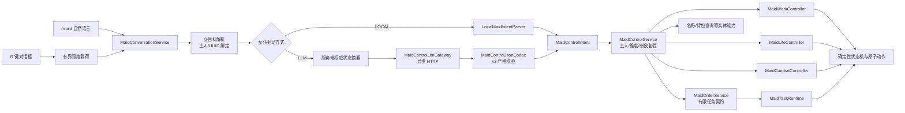
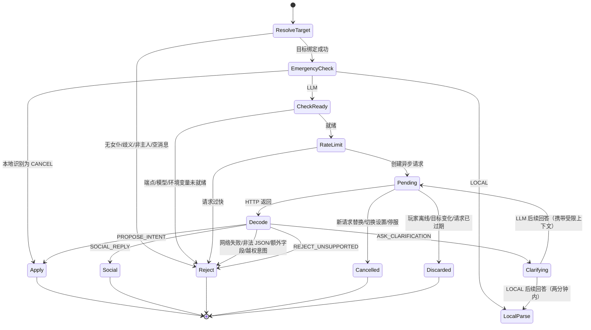

# AI Partner v0.10：自然语言双驱动设计与验收

## 1. 版本目标

v0.10 为既有女仆玩法增加统一的自然语言控制面，不让模型接管实体 AI。玩家默认按 `R` 打开专用对话框；每个女仆可独立选择：

- `LOCAL`：完全离线的有限中英文规则解析；
- `LLM`：调用 `config/ai-partner.json` 指定的 OpenAI-compatible Chat Completions 端点。

命令和原背包 GUI 按钮仍保留为确定性管理、调试与无网络入口。R 键和 `/maid <自然语言>` 共享同一条对话服务链路。旧 v0.4 `job_spec.schema.json` 只服务于旧实验兼容代码；实际玩法使用新的 `maid_control.schema.json` v2 协议。

## 2. 玩家使用方式

```text
R                                         打开当前选中女仆的对话框
@小雪 去砍树                              临时指定“小雪”，不改变长期选择
@b10a 全天工作                            也可使用至少 4 位 UUID 前缀
/maid driver                              查看当前女仆驱动设置
/maid driver mode local|llm               切换驱动方式
/maid driver api-key-env DEEPSEEK_API_KEY 设置环境变量名
```

对话框只有“API Key 环境变量名”字段，没有 API Key 值字段。以 Windows PowerShell 为例，用户在启动游戏之前自行设置真实密钥：

```powershell
$env:DEEPSEEK_API_KEY="<仅存在于当前进程环境中的真实密钥>"
```

模组只保存字符串 `DEEPSEEK_API_KEY`，不会保存上面尖括号中的值。专用服务器必须让服务器 Java 进程继承该环境变量；客户端环境变量不能替代专用服务器的配置。

## 3. 总体架构



关键依赖方向是 `client → conversation → control → 既有服务端控制器`。`core`、`work`、`life`、`combat` 不依赖客户端或 LLM，因此切回本地驱动时不会出现两套实体 AI。

## 4. 对话请求状态机



异步请求记录玩家 UUID、女仆 UUID 和请求对象。返回时不会重新读取“当前选中女仆”来决定执行目标，因此玩家在模型思考期间执行 `/maid select` 不会把结果误投给另一名女仆。

## 5. v2 控制意图

| 意图 | 作用 | 最终执行模块 |
|---|---|---|
| `RUN_TASK` | 跟随、待命、取消、定量采集/存箱/搬运 | `MaidOrderService` + 契约/任务运行时 |
| `SET_WORK_MODE` | 选择/停止 17 种持续工作 | `MaidWorkController` |
| `SET_SCHEDULE` | 日班、夜班、全天 | `MaidLifeController` |
| `SET_COMBAT_POLICY` | 关闭、自卫、保护主人 | `MaidCombatController` |
| `RETURN_HOME` | 返回当前日程活动地点 | 手动指令运行时 |
| `CONFIGURE_LOCATION` | 设置/清除工作、休闲、睡眠地点 | `MaidLifeController` |
| `SET_HOME_BOUND` / `SET_RADIUS` | 活动区域约束 | `MaidLifeController` |
| `RENAME` | 修改显示名称 | `AiPartnerEntity` |
| `QUERY_STATUS` / `QUERY_INVENTORY` | 只读查询 | `AiPartnerEntity` |
| `RETRIEVE_INVENTORY` | 无运行任务时归还物品 | `AiPartnerEntity` |

LLM 输出根对象固定包含 `schema_version`、`dialogue_act`、`intent`、`response_text`。codec 使用字段完全相等检查；任意 `command`、坐标、NBT、脚本或额外字段都会让整个输出失效。即使结构合法，服务端仍会执行主人、维度、白名单、数量、半径、工具、物品、容器、`mobGriefing` 和运行时状态校验。

## 6. 密钥与隐私边界

- 世界存档：仅 `MaidDriveMode` 和 `MaidLlmApiKeyEnvironmentVariable`；
- 客户端网络：仅驱动枚举、环境变量名、就绪布尔值和错误代码；
- HTTP 请求：Authorization 头在请求时从 `System.getenv(变量名)` 构造；
- 日志：新玩法对话链路不记录 API Key，也没有接入旧实验日志；
- LLM 上下文：包含女仆状态、任务/工作/日程、防御、生命、活动半径和有界背包摘要，不发送精确坐标、任意 NBT 或附近实体列表；
- 失败策略：LLM 失败不会自动回退到规则解析并意外执行；用户可明确切回 `LOCAL`。

## 7. 代码组织

```text
control/
  MaidControlIntent                 类型化高层意图
  MaidControlJsonCodec              v2 模型输出严格校验
  MaidControlService                服务端统一复验与路由
  LocalMaidIntentParser             离线中英文解析
  MaidDriveMode / MaidDriverSettings

conversation/
  MaidConversationService           对话编排、限速、取消、澄清、过期丢弃
  MaidConversationTargetResolver    @名称/UUID 前缀与稳定目标绑定
  MaidConversationNetworking        服务端网络注册与设置复验
  *Payload                           有长度上限的网络载荷

llm/
  MaidControlLlmGateway             OpenAI-compatible 异步调用
  MaidControlLlmResult              归一化返回结果

world/
  MaidControlContextSnapshot        有界服务端权威上下文

client/conversation + client/screen/
  MaidConversationClient            R 键和客户端接收器
  MaidConversationScreen            对话/驱动设置界面
```

## 8. 自动验证

- `compileJava` 与 `compileClientJava`：通过；
- `test`：97/97 通过；
- 新增覆盖：v2 正常意图、查询、澄清、Markdown/额外字段/参数不匹配拒绝、环境变量名、驱动模式回退、离线工作/日程/防御/查询/中文改名，以及 `@` 多词名称的 token 边界。

## 9. 实机验收（2026-07-22）

使用 `gradlew runClient` 启动真实开发客户端，并在单人世界中完成以下验收：

- 没有已绑定女仆时按 R，服务端正确拒绝并提示先生成女仆；
- `/maid spawn` 后按 R，可打开目标为 `AI Maid 5A68` 的专用对话框；
- 默认显示 `LOCAL`、环境变量名 `DEEPSEEK_API_KEY` 和模型 `deepseek-v4-flash`；
- 本地输入“全天工作”，成功切换为全天日程；
- 本地输入 `@AI Maid 5A68 去砍树`，成功切换为伐木工作，验证了带空格名称的 `@` 定向；
- 在界面切换为 `LLM` 并保存后，使用真实 OpenAI-compatible 接口解释“请待在这里”，成功执行 `STAY`；
- `/maid driver` 正确报告 `llm`、环境变量名和 `READY`，未展示或保存密钥值；
- 保存退出并重新进入世界后，R 界面仍恢复为 `LLM` 且配置就绪；
- `/maid driver mode local|llm` 与 `/maid driver api-key-env DEEPSEEK_API_KEY` 均通过；
- 再次调用真实模型解释“请开始钓鱼工作”，成功产生 v2 `SET_WORK_MODE` 并切换为钓鱼工作；
- 收尾时已停止持续工作并切回 `LOCAL`，随后正常保存世界并退出客户端。

`latest.log` 中没有本模组运行异常。开发客户端使用 Fabric 测试身份，因此存在预期的 Mojang/Realms 鉴权 401；它不影响单人世界、对话网络或 LLM 接口验收。
